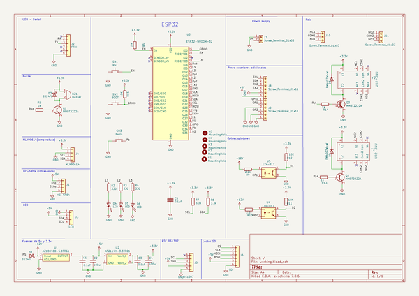

# OOMP Project  
## meditemp  by ElectronicCats  
  
(snippet of original readme)  
  
- MediTemp  
  
-- ¿Qué es?  
MediTemp-C es una estación autónoma de medición de temperatura corporal, ideal para la presente situación de contingencia nacional y mundial.   
Con MediTemp-C se puede realizar un control de acceso a establecimientos comerciales, bares, restaurantes, etc.   
  
La estación realiza una medición de temperatura corporal de manera no invasiva y sin contacto con las personas por medio de su sensor infrarrojo, además de realizar un conteo y registro de los datos los cuales pueden ser consultados y/o descargados vía inalámbrica por medio de cualquier dispositivo móvil o computadora  
  
-- ¿Cómo funciona?  
1. La persona llega a la estación MediTemp-C acercando la frente o la parte interna de la muñeca al sensor de temperatura. La estación cuenta con un sensor de distancia indicando que tan cerca se debe de estar para una correcta medición.  
  
2. Una vez realizada la medición de temperatura la estación muestra la temperatura de la persona por medio de una pantalla alfanumérica y guardará un registro el cual consiste en un conteo de personas, el valor medido de temperatura la fecha y la hora del registro.   
  
3. En caso de que se detecte a una persona con temperatura alta, la estación emitirá una alarma audible y encenderá un indicador luminoso.   
  
4. MediTemp-C cuenta con salidas electrónicas las cuales pueden activar o desactivar chapas o cerraduras magnéticas en caso de ser requerido para permitir o no permitir el acceso a personas con alta temperatura.  
  
5. La estación mue  
  full source readme at [readme_src.md](readme_src.md)  
  
source repo at: [https://github.com/ElectronicCats/meditemp](https://github.com/ElectronicCats/meditemp)  
## Board  
  
  
## Schematic  
  
  
  
[schematic pdf](working_schematic.pdf)  
## Images  
  
  
  
  
  
  
