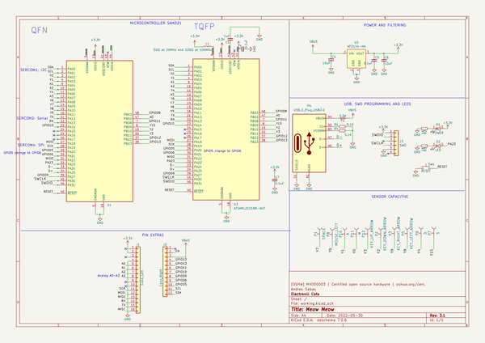
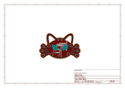
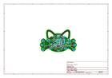
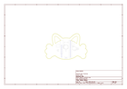
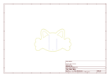
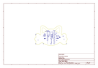
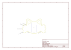

# OOMP Project  
## MeowMeow  by ElectronicCats  
  
oomp key: oomp_projects_flat_electroniccats_meowmeow  
(snippet of original readme)  
  
  
  
  
  
**[OSHW] MX0003 | Certified open source hardware |** [oshwa.org/cert.](https://www.oshwa.org/cert)  
  
  
  
  
  Meow Meow es una tarjeta electrónica diseñada por Electronic Cats  que simula algunas teclas configurables del teclado y mouse.  La Meow Meow tiene la característica de poder conectar cualquier material que conduzca  la electricidad convirtiendo estos objetos en paneles táctiles.   
  
  Es un kit de experimentos para principiantes y expertos que buscan interactuar entre mundo real y la tecnología. La meow meow puede cubrir las áreas de artes plásticas, artes visuales, música, deporte, ingeniería e  incluso rehabilitación física.  
  
-- ¿Para quién es Meow Meow?   
  
  Personas de 6 años en adelante, educadores, artistas, ingenieros, diseñadores, inventores y creadores.   
  
-- ¿Cómo funciona?   
  
  El Meow Meow utiliza conmutación de alta capacitancia para detectar cuándo ha realizado una conexión incluso con materiales que no son muy conductores (como hojas, pasta o personas). Esta técnica atrae, Meow Meow también puede actuar como un teclado o un mouse. Hay seis entradas en la parte frontal de la placa, que se pueden unir a través de cabl  
  full source readme at [readme_src.md](readme_src.md)  
  
source repo at: [https://github.com/ElectronicCats/MeowMeow](https://github.com/ElectronicCats/MeowMeow)  
## Board  
  
  
## Schematic  
  
  
  
[schematic pdf](working_schematic.pdf)  
## Images  
  
  
  
  
  
  
  
  
  
  
  
  
  
  
  
  
