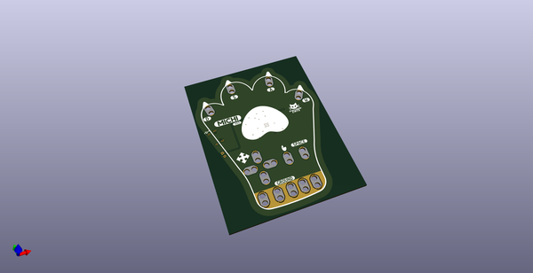
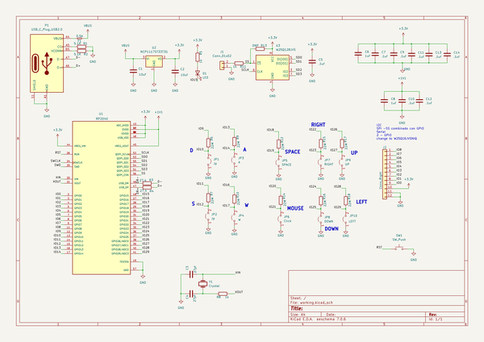
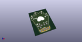
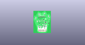
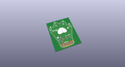
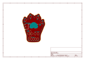
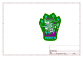
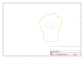
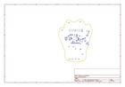
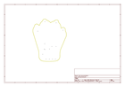

# OOMP Project  
## michi  by ElectronicCats  
  
oomp key: oomp_projects_flat_electroniccats_michi  
(snippet of original readme)  
  
- Michi  
  
  
  
  
  Michi is an electronic board designed by Electronic Cats that simulates configurable keyboard and mouse keys. It has the feature of being able to connect to any conductive material, turning these objects into touch panels.   
  
  It is an experiment kit for beginners and experts looking to interact between the real world and technology. The Michi can cover the areas of plastic arts, visual arts, music, sports, engineering and even physical rehabilitation.  
  
-- For whom is Michi?   
  
  People 6 years and older, educators, artists, engineers, designers, inventors and creators.   
  
-- How does it work?  
  
  The Michi uses high resistance switching to detect when it has made a connection even with materials that are not very conductive (such as leaves, pasta or people). This technique attracts, Michi can also act as a keyboard or mouse. There are 10 inputs on the front of the board, which can be linked via alligator wires or any other method you can think of. There are another 5 inputs on the back, 3 for keyboard keys and 2 for mouse movement, which can be accessed with jumpers.  
  
  For example, when you connect and touch an apple, you make a connection, and Michi sends the computer a keyboard message. The computer sees Michi as an ordinary keyboard (or mouse). Therefore, it works with all programs, operating systems and   
  full source readme at [readme_src.md](readme_src.md)  
  
source repo at: [https://github.com/ElectronicCats/michi](https://github.com/ElectronicCats/michi)  
## Board  
  
  
## Schematic  
  
  
  
[schematic pdf](working_schematic.pdf)  
## Images  
  
  
  
  
  
  
  
  
  
  
  
  
  
  
  
  
  
  
  
  
  
  
