# OOMP Project  
## MicroBatteryCharger-Croquette  by ElectronicCats  
  
oomp key: oomp_projects_flat_electroniccats_microbatterycharger_croquette  
(snippet of original readme)  
  
- Electronic Cats Croquette Micro Lipo/Lion Battery Charger  
  
This little lipo charger is so small and easy to use you can keep it on your desk or mount it easily into any project! A 3.7V/4.2V lithium polymer or lithium ion rechargeable battery into the connectors. There are two LEDs - one red and one green. While charging, the red LED is lit. When the battery is fully charged and ready for use, the green LED turns on. Seriously, it could not get more easy.  
  
For use with LiPoly/LiIon batteries only! Other batteries may have different voltage, chemistry, polarity or pinout. Lipo/Lipoly/LiIon Batteries not included, but we've got tons in the shop.  
  
Charging is performed in three stages: first a preconditioning charge, then a constant-current fast charge and finally a constant-voltage trickle charge to keep the battery topped-up. The charge current is 100mA by default, so it will work with any size battery and USB port. If you want you can easily change it over to 500mA mode by soldering closed the jumper on the front, for when you'll only be charging batteries with 500mAh size or larger.  
  
- 5V input  
- For charging single Lithium Ion/Lithium Polymer 3.7/4.2v batteries (not for older 3.6/4.1v cells)  
- 100mA charge current, adjustable to 500mA by soldering a jumper closed  
  
  
--- Maintainer  
  
Electronic Cats invests time and resources providing this open source design, please support Electronic Cats and open-source hardware by purchasing products from Electronic Cats!  
  
--- License  
  
  
source repo at: [https://github.com/ElectronicCats/MicroBatteryCharger-Croquette](https://github.com/ElectronicCats/MicroBatteryCharger-Croquette)  
## Board  
  
[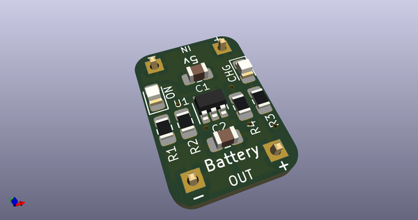](working_3d.png)  
## Schematic  
  
[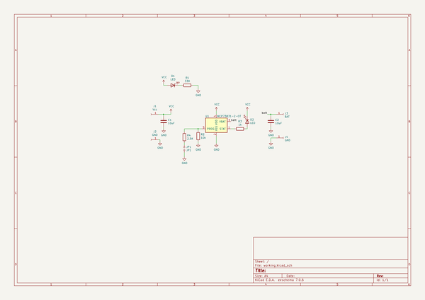](working_schematic.png)  
  
[schematic pdf](working_schematic.pdf)  
## Images  
  
[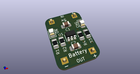](working_3d.png)  
  
[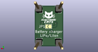](working_3d_back.png)  
  
  
  
[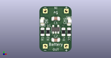](working_3d_front.png)  
  
[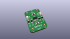](working_3D_top.png)  
  
[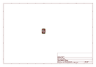](working_assembly_page_01.png)  
  
[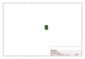](working_assembly_page_02.png)  
  
[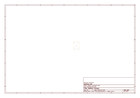](working_assembly_page_03.png)  
  
[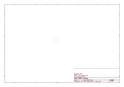](working_assembly_page_04.png)  
  
[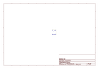](working_assembly_page_05.png)  
  
[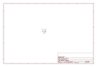](working_assembly_page_06.png)  
