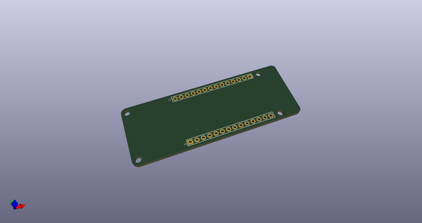
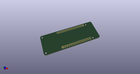
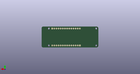
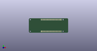

# OOMP Project  
## MKR_shield_template  by ElectronicCats  
  
oomp key: oomp_projects_flat_electroniccats_mkr_shield_template  
(snippet of original readme)  
  
- MKR Shield Template  
  
Template of shield family MKR Arduino in KiCad 5  
  
  
  
  
Electronic Cats invests time and resources providing this open source design, please support Electronic Cats and open-source hardware by purchasing products from Electronic Cats!  
  
Designed by Electronic Cats.  
  
Hardware released under an CERN Open Hardware Licence v1.2. See the LICENSE_HARDWARE file for more information.  
  
Electronic Cats is a registered trademark, please do not use if you sell these PCBs.  
  
July 2018  
  
  full source readme at [readme_src.md](readme_src.md)  
  
source repo at: [https://github.com/ElectronicCats/MKR_shield_template](https://github.com/ElectronicCats/MKR_shield_template)  
## Board  
  
  
## Schematic  
  
  
  
[schematic pdf](working_schematic.pdf)  
## Images  
  
  
  
  
  
  
