# OOMP Project  
## NFC-Copy-Cat  by ElectronicCats  
  
oomp key: oomp_projects_flat_electroniccats_nfc_copy_cat  
(snippet of original readme)  
  
- NFC Copy Cat  
  
NFC Copy Cat, manufactured by Electronic Cats, is a small device that combines two powerful cybersecurity tools, NFCopy and MagSpoof. NFCopy works by reading or emulating an NFC card; depending on the necessities of the researcher. On the other hand, MagSpoof can wirelessly emulate/spoof any magnetic stripe card. So using NFC Copy Cat, the user will have a device capable of storing magnetic stripe data or NFC payment data to be replayed later — known in the cybersecurity world as a replay attack.   
  
To show the capabilities of NFC Copy Cat, the emulation example will use a Visa MSD protocol. So be aware that this type of transaction will not be accepted in some payment systems.  
  
NFC Copy Cat combines a simple user interface that can be programmed using Arduino IDE. Adding a micro USB connection, 3.7V LiPo battery connector, antenna, two programmable buttons, LEDs and a reset button. The most important part, NFC Copy Cat is an open hardware project. So anyone could modify or redesign it on their own.  
  
Devices like NFC Copy Cat are essential for researchers, students, teachers or anyone interested in payment systems. It will help to understand how the payment system works, the communications or the APDU protocol.   
  
Some of the code examples that will be available introduce different concepts. For example, how to detect a card reader, how to detect an NFC card, how to use MagSpoof using a button as a trigger to spoof, how to use NFC with a button to emulate, how t  
  full source readme at [readme_src.md](readme_src.md)  
  
source repo at: [https://github.com/ElectronicCats/NFC-Copy-Cat](https://github.com/ElectronicCats/NFC-Copy-Cat)  
## Board  
  
[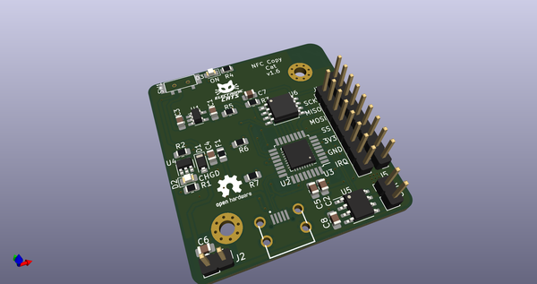](working_3d.png)  
## Schematic  
  
[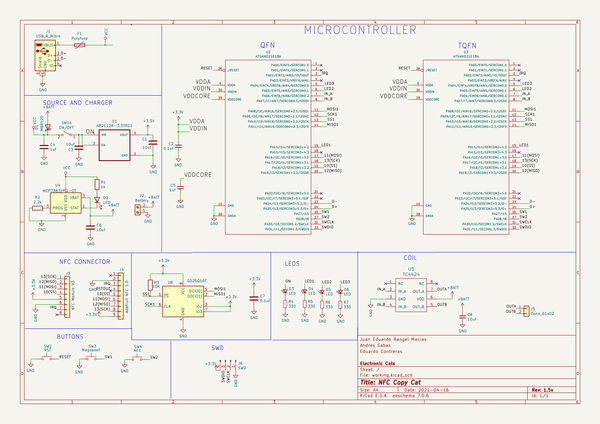](working_schematic.png)  
  
[schematic pdf](working_schematic.pdf)  
## Images  
  
[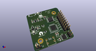](working_3d.png)  
  
[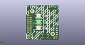](working_3d_back.png)  
  
[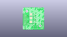](working_3D_bottom.png)  
  
[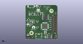](working_3d_front.png)  
  
[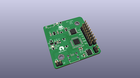](working_3D_top.png)  
  
[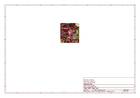](working_assembly_page_01.png)  
  
[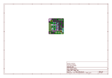](working_assembly_page_02.png)  
  
[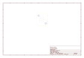](working_assembly_page_03.png)  
  
[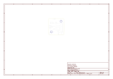](working_assembly_page_04.png)  
  
[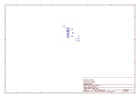](working_assembly_page_05.png)  
  
[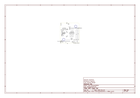](working_assembly_page_06.png)  
