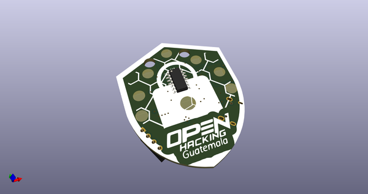
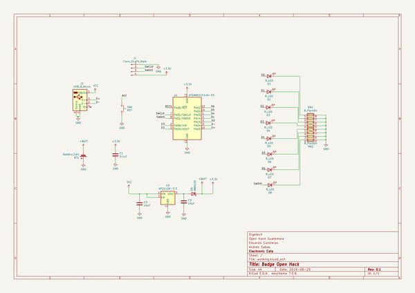
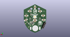
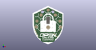

# OOMP Project  
## OpenHackBadge  by ElectronicCats  
  
oomp key: oomp_projects_flat_electroniccats_openhackbadge  
(snippet of original readme)  
  
- Badge OpenHack Guatemala  
  
Este es un badge electronico que hemos creado para nuestros amigos de OpenHack Guatemala 2019, en este repositorio encontraras todos los archivos necesarios para conocer el badge, ahora saca el maximo pontencial de tu badge.  
  
  
  
  
  
  
--- Installation Instructions  
  
**Install SAMD soport**  
  
You must install the boards SAMD of Arduino(vertions 1.6.11 o posterior)   
  
In the menú bar selec tools --> boards --> Board Manager --> Arduino SAMD Boards 32 bit M0.  
  
In the search bar write  "SAMD" en then you can see the boards, do clic in install and wait to finish to installe.  
  
  
  
  
To add board support for our products, start Arduino and open the Preferences window (**File** > **Preferences**). Now copy and paste the following URL into the 'Additional Boards Manager URLs' input field:  
  
	https://electroniccats.github.io/Arduino_Boards_Index/package_electroniccats_index.json  
  
  
- If there is already an URL from another manufacturer in that field, click the button at the right end of the field. This will open an editing window allowing you to paste the above URL onto a new line.  
  
- Press the "OK" button.  
- Open the "boards manager" that is in tools --> Boa  
  full source readme at [readme_src.md](readme_src.md)  
  
source repo at: [https://github.com/ElectronicCats/OpenHackBadge](https://github.com/ElectronicCats/OpenHackBadge)  
## Board  
  
  
## Schematic  
  
  
  
[schematic pdf](working_schematic.pdf)  
## Images  
  
  
  
  
  
  
