# OOMP Project  
## pawprotector  by ElectronicCats  
  
oomp key: oomp_projects_flat_electroniccats_pawprotector  
(snippet of original readme)  
  
  
- Paw Protector  
  
- Attach between your USB cable and charger to physically block data transfer / syncing. Charge mobile devices without any pop-ups or risk of hacking / downloading viruses in cars, airports etc  
- Our SmartCharge chip automatically switches between Apple, Universal and Samsung standards to ensure compatibility with your device and charge at up to 2.4A  
- This is our USB-A to A model.  
- Paw Protector protects your mobile data from being accidentally shared, stolen, or infected with malware! Paw Protector only transfers power, not your privacy!  
- Completely open source  
  
  
  
-- Wiki  
  
For more details, please see the [Wiki](https://github.com/ElectronicCats/pawprotector/wiki) section.  
  
-- License  
  
  
  
Electronic Cats invests time and resources providing this open source design, please support Electronic Cats and open-source hardware by purchasing products from Electronic Cats!  
  
Designed by Electronic Cats.  
  
Firmware released under an GNU AGPL v3.0 license. See the LICENSE file for more information.  
  
Hardware released under an CERN Open Hardware Licence v1.2. See the [LICENSE_HARDWARE](https://github.com/ElectronicCats/pawprotector/blob/main/LICENSE_HARDWARE.md) file for more information.  
  
Electronic Cats i  
  full source readme at [readme_src.md](readme_src.md)  
  
source repo at: [https://github.com/ElectronicCats/pawprotector](https://github.com/ElectronicCats/pawprotector)  
## Board  
  
[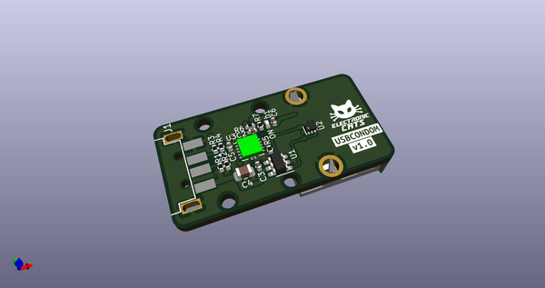](working_3d.png)  
## Schematic  
  
[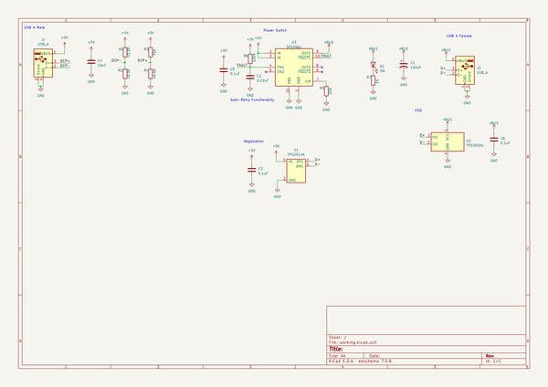](working_schematic.png)  
  
[schematic pdf](working_schematic.pdf)  
## Images  
  
[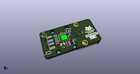](working_3d.png)  
  
[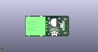](working_3d_back.png)  
  
[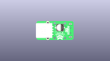](working_3D_bottom.png)  
  
[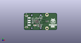](working_3d_front.png)  
  
[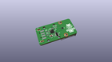](working_3D_top.png)  
  
[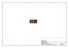](working_assembly_page_01.png)  
  
[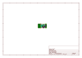](working_assembly_page_02.png)  
  
[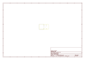](working_assembly_page_03.png)  
  
[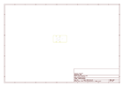](working_assembly_page_04.png)  
  
[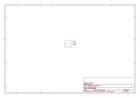](working_assembly_page_05.png)  
  
  
