# OOMP Project  
## PicoWAN  by ElectronicCats  
  
oomp key: oomp_projects_flat_electroniccats_picowan  
(snippet of original readme)  
  
- PicoWAN  
  
PicoWAN is all the best in the world format Feather and LoRa with a Raspberry Pico Core!, Feather pin to pin compatible with a USB-C port.  
  
We love all our Feathers equally, but this Feather is very special. It's our first Feather that is specifically designed for use with CircuitPython! CircuitPython is our beginner-oriented flavor of MicroPython - and as the name hints at, its a small but full-featured version of the popular Python programming language specifically for use with circuitry and electronics.  
  
Please note, CircuitPython does not come preloaded. See the full guide linked below for instructions on installing it  
  
- License  
  
Electronic Cats invests time and resources providing this open source design, please support Electronic Cats and open-source hardware by purchasing products from Electronic Cats!  
  
Designed by Electronic Cats.  
  
Firmware released under an GNU AGPL v3.0 license. See the LICENSE file for more information.  
  
Hardware released under an CERN Open Hardware Licence v1.2. See the LICENSE_HARDWARE file for more information.  
  
Electronic Cats is a registered trademark, please do not use if you sell these PCBs.  
  
January 2020  
  
  full source readme at [readme_src.md](readme_src.md)  
  
source repo at: [https://github.com/ElectronicCats/PicoWAN](https://github.com/ElectronicCats/PicoWAN)  
## Board  
  
  
## Schematic  
  
[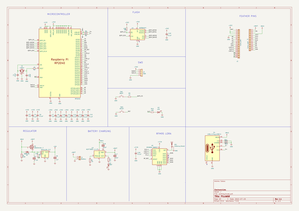](working_schematic.png)  
  
[schematic pdf](working_schematic.pdf)  
## Images  
  
[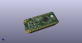](working_3d.png)  
  
[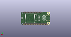](working_3d_back.png)  
  
[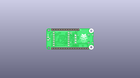](working_3D_bottom.png)  
  
[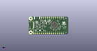](working_3d_front.png)  
  
[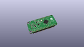](working_3D_top.png)  
  
[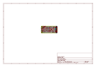](working_assembly_page_01.png)  
  
[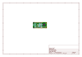](working_assembly_page_02.png)  
  
[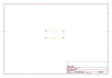](working_assembly_page_03.png)  
  
[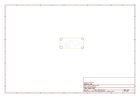](working_assembly_page_04.png)  
  
[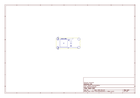](working_assembly_page_05.png)  
  
[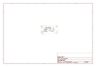](working_assembly_page_06.png)  
