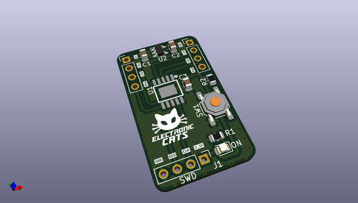
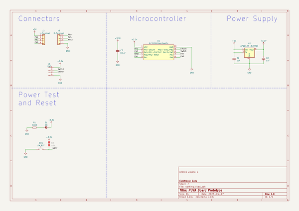
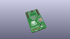
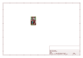
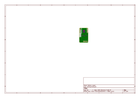
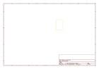
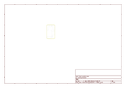
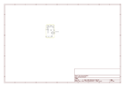

# OOMP Project  
## puya-projects  by ElectronicCats  
  
(snippet of original readme)  
  
  
- Plantilla para proyectos de ingeniería  
  
Esta plantilla es la base para cualquier proyecto desarrollado en Electronic Cats.  
  
Automáticamente, se generarán todos los archivos necesarios para la compra de material, fabricación y ensamble.  
  
Así como documentos complementarios para un proyecto completo.  
  
    
  
> Este README.md puede ser utilizado como plantilla para documentación, de esta manera se puede incluir generalidades, recomendaciones y todo lo necesario para entender el proyecto.  
  
    
  
-- ¿Cómo utilizar esta plantilla?  
  
Para comenzar un nuevo proyecto, presiona el botón de "Use this template".  
  
    
  
--- KiCad  
  
Para esta plantilla, el hardware debe de ser diseñado y/o desarrollado en KiCad 6.  
  
Al término del diseño del proyecto, KiCad deberá de generar los siguientes archivos:  
  
    
  
- nombre_del_proyecto.kicad_pro  
  
- nombre_de_la_pcb.kicad_pcb  
  
- nombre_del_esquematico.kicad_sch  
  
    
  
Además de archivos temporales, los cuales Git ignora al momento de cualquier push.  
  
[Archivos ignorados](.gitignore)  
  
    
  
Estos archivos deberán ser guardados dentro de la carpeta de [hardware](hardware/).  
  
    
  
--- Configuración de automatización  
  
Una vez terminado el proyecto, antes de hacer el primer Release, se deberán realizar algunos cambios para la automatización de archivos.  
  
En la carpeta [.github/workflows](.github/workflows/) se encuentra el archivo kicad_kibot.yml, en donde los siguientes campos deberán ser modificados  
  
    
  
```yaml  
  
- optional - schematic file  
  
schema: 'hardware/Templ  
  full source readme at [readme_src.md](readme_src.md)  
  
source repo at: [https://github.com/ElectronicCats/puya-projects](https://github.com/ElectronicCats/puya-projects)  
## Board  
  
[](working_3d.png)  
## Schematic  
  
[](working_schematic.png)  
  
[schematic pdf](working_schematic.pdf)  
## Images  
  
[](working_3D_bottom.png)  
  
[](working_3D_top.png)  
  
[](working_assembly_page_01.png)  
  
[](working_assembly_page_02.png)  
  
[](working_assembly_page_03.png)  
  
[](working_assembly_page_04.png)  
  
[](working_assembly_page_05.png)  
  
[](working_assembly_page_06.png)  
