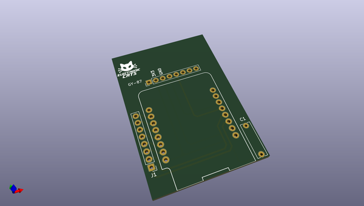
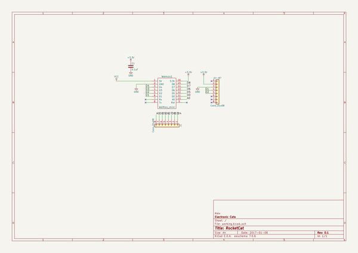

# OOMP Project  
## RocketCat  by ElectronicCats  
  
oomp key: oomp_projects_flat_electroniccats_rocketcat  
(snippet of original readme)  
  
- RocketCat: Kit of Water Rocket WiFi  
  
  
  
Fuente: Ein wahres Probiertes und Pracktisches geschriebenes Feuerbuch    
Autor: Franz Helm  
  
  
Si tu eres un fanatico de los cohetes y deseas experimentar con electronica, WiFi y cohetes de agua, RocketCat es un kit open source para niños, adultos y todo fan que desea aprender de esta tecnologia. ¡Ciencia en acción!  
  
--- Construye y lanza un cohete  
Construye tu propio cohete con solo una botella, electronica, agua y una bomba. ¡Mira cómo el cohete se eleva muy alto mientras bombeas aire hacia él! Alimentado por agua y presión de aire mientras observas todos los cambios de aceleracion, orientacion y altura en tu smartphone o computadora.  
  
--- Ciencia y aprendizaje divertidos  
El Kit RocketCat es perfecto para el estudiante o el entusiasta de la ciencia. Se incluye todo lo que necesita para construir su propio cohete de agua mientras aprende sobre la tecnología.  
  
--- Todo para construir tu cohete  
El kit Rocket contiene:  
  
- 1 Botella de plástico  
- 4 Aletas (una para el repuesto)  
- 1 Soporte para aletas  
- 1 Tapón  
- 1 Conector para tapón   
- 1 Conector para bomba   
- 1 Tubo de extensión de plástico,   
- 1 Tarjeta electronica par  
  full source readme at [readme_src.md](readme_src.md)  
  
source repo at: [https://github.com/ElectronicCats/RocketCat](https://github.com/ElectronicCats/RocketCat)  
## Board  
  
  
## Schematic  
  
  
  
[schematic pdf](working_schematic.pdf)  
## Images  
