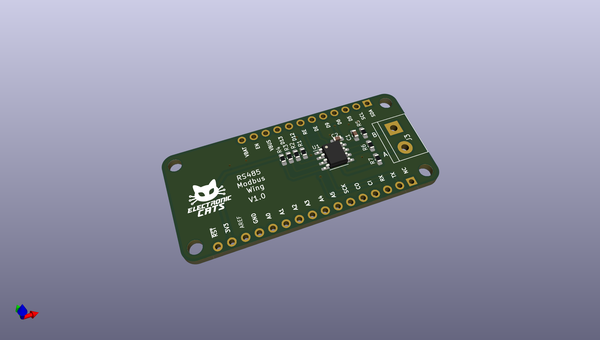
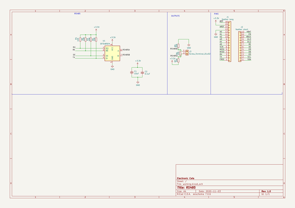
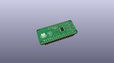
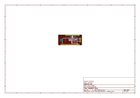
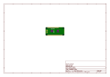
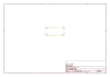
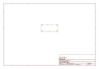
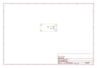

# OOMP Project  
## RS485_Modbus_FeatherWing  by ElectronicCats  
  
(snippet of original readme)  
  
- RS485 Modbus FeatherWing  
  
A Feather board without ambition is a Feather board without FeatherWings! This is a Wing board for the SP3485 RS-485 transceiver IC, which will convert a UART serial stream to RS-485. The SP3485 is a half-duplex transceiver, so it can only communicate one way at a time, but it can reach transmission speeds of up to 10Mbps. This board requires a very low amount of power and can operate from a single +3.3VDC supply.  
  
Works with all Feathers except for those with USB-Serial converters that use the UART pins. Right now that means the ESP8266 Huzzah Feather and nRF52832 Feather don't work.  
  
  
-- Features  
- Fully equipped with SP3485 RS-485 transceiver and supporting components  
- Operates from a single +3.3V supply  
- Interoperable with +5.0V logic  
- RS-485 input/output broken out to RJ-45 connector, 3.5mm screw terminal, and 0.1" pitch header  
- Driver/Receiver Enable connected to RTS line  
- 7V to +12V Common-Mode Input Voltage Range  
- Allows up to 32 transceivers on the serial bus  
- Driver Output Short-Circuit Protection  
  
Each order comes with one assembled and tested FeatherWing, plus some header. You will need to solder in the header yourself but its a quick task.  
  
  
-- License  
  
  
Electronic Cats invests time and resources providing this open source design, please support Electronic Cats and open-source hardware by purchasing products from Electronic Cats!  
  full source readme at [readme_src.md](readme_src.md)  
  
source repo at: [https://github.com/ElectronicCats/RS485_Modbus_FeatherWing](https://github.com/ElectronicCats/RS485_Modbus_FeatherWing)  
## Board  
  
  
## Schematic  
  
  
  
[schematic pdf](working_schematic.pdf)  
## Images  
  
  
  
  
  
  
  
  
  
  
  
  
  
  
  
  
