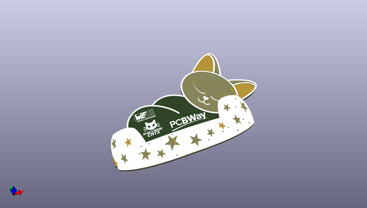
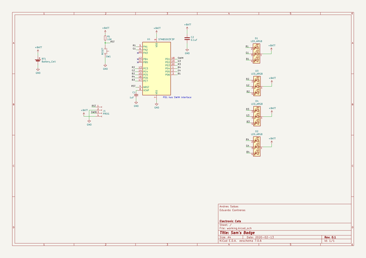

# OOMP Project  
## Sam-badge  by ElectronicCats  
  
(snippet of original readme)  
  
- Badge Sam Dulces Sueños  
-- Reto de soldadura   
  
  
  
Divierte con nuestro nuevo Badge!, __“Sam dulces sueños”__ ha llegado y es increíblemente bonito y tierno. Está creado para enseñarte a soldar tu primera placa electrónica de componentes de soldado superficial SMD. ¿Aceptas el reto?.  
  
Aunque originalmente este badge fue realizado para presentarse como taller en el evento de innovación y tecnología __“Talent Land 2020”__, no queríamos dejarte sin la experiencia de crear y aprender con nuestro aventurero amigo Sam, por lo tanto debido a la contingencia sanitaria el evento solo se realizará de manera virtual el próximo 8 y 9 de Julio en Iron Land @ Home.   
  
Nuestros amigos de **Wurth Electronics, Talent Land, PCBWay y Electronic Cats**, queremos regalarte uno de los 200 badge que tenemos disponibles, para que participes en este reto desde la comodidad de tu casa.  
  
¡Nosotros ponemos la electrónica, tu solo paga el envío!.   
  
Lo único que debes hacer es cubrir el costo del envio hasta tu domicilio y tener en cuenta los requerimientos para participar.   
Una vez realizado el pedido, enviaremos tu badge y tendrás hasta el **3 de Julio del 2020** para subir a redes sociales tus  fotografías o videos de tu __“Sam dulces sueños”__ ensamblado y funcionando. Recuerda que deberás etiquetar a Wurth Electronics, Talend La  
  full source readme at [readme_src.md](readme_src.md)  
  
source repo at: [https://github.com/ElectronicCats/Sam-badge](https://github.com/ElectronicCats/Sam-badge)  
## Board  
  
  
## Schematic  
  
  
  
[schematic pdf](working_schematic.pdf)  
## Images  
