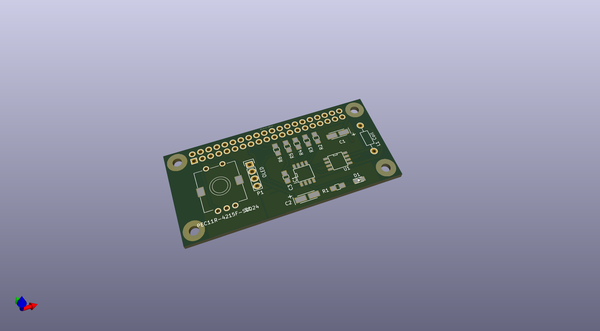
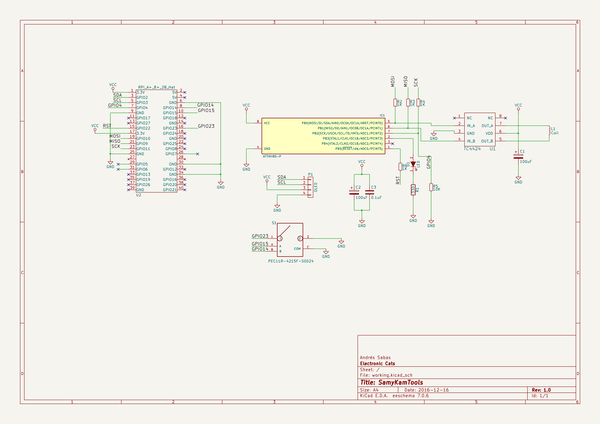

# OOMP Project  
## SamyKamTools  by ElectronicCats  
  
(snippet of original readme)  
  
<a href="https://github.com/sponsors/ElectronicCats">  
    
</a>  
  
- SamyKamTools  
  
SamyKam - A set of pentesting tools to test Mag-Stripe readers and tokenization processes  
  
Code and hardware integration by [Salvador Mendoza] (https://salmg.net)  
  
PCB design and advisory by Team work with [electronicats] (https://twitter.com/electronicats)  
  
Named the tool in honor of Samy Kamkar (http://samy.pl)  
For his hard work and community support  
  
-- Features  
It is a MagSpoof but specfically designed for Raspberry Pi:  
- OLED for prepared attacks  
- Rotary endoder for navigation menu  
  
Support:  
Mini-shell for basic commands implementing Bluetooth and Webserver independently  
- change parameters without ssh  
- send any shell command using Bluetooth  
  
-- Installation   
  
--- Manual  
  
```  
apt-get update   
apt-get install python-dev python-setuptools swig python-bluez gcc-avr binutils-avr avr-libc  
  
- gdata-2  
curl -L https://pypi.python.org/packages/a8/70/bd554151443fe9e89d9a934a7891aaffc63b9cb5c7d608972919a002c03c/gdata-2.0.18.tar.gz-md5=13b6e6dd8f9e3e9a8e005e05a8329408 | tar xzf -  
cd gdata-2.0.18  
python setup.py install  
  
- WiringPi  
git clone git://git.drogon.net/wiringPi  
cd wiringPi  
./build  
  
  
- WiringPi-Python  
git clone --recursive https://github.com/ElectronicsCats/WiringPi-Python  
cd WiringPi-Python  
./build.sh  
python setup.py install  
  
  
- SPIDEV  
git clone https://github.com/doceme/py-spidev  
cd py-spidev  
python se  
  full source readme at [readme_src.md](readme_src.md)  
  
source repo at: [https://github.com/ElectronicCats/SamyKamTools](https://github.com/ElectronicCats/SamyKamTools)  
## Board  
  
[](working_3d.png)  
## Schematic  
  
[](working_schematic.png)  
  
[schematic pdf](working_schematic.pdf)  
## Images  
