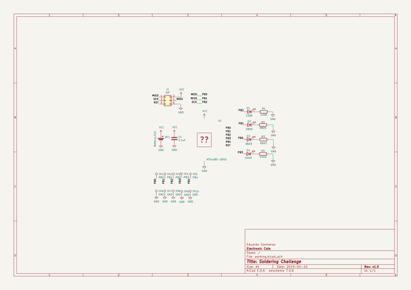

# OOMP Project  
## SolderingChallenge  by ElectronicCats  
  
oomp key: oomp_projects_flat_electroniccats_solderingchallenge  
(snippet of original readme)  
  
Introduction  
============  
  
This design is based on the work of [aspro648](https://github.com/aspro648) you can support him buying his stuff at [Tindie](https://www.tindie.com/products/MakersBox/smd-challenge/)  
  
This design was possible thanks to [Mouser electronics](https://iopscience.iop.org/journal/2041-8205/page/Focus_on_EHT), [Würth Elektronik](https://www.we-online.com/web/en/electronic_components/willkommen_pbs/Welcome.php) and [Makers GDL](https://makersgdl.com/) we really appreciate all your support to get this boards free for the Talent Land 2019.  
  
   
Test your surface mount soldering skills out, starting with a 1206 package and work your way down into the humanly possible solder device, the 0402. Powered by a CR2032 coin cell and Attiny 85 SOIC.   
  
  
Design Files  
============  
This project is designed using Open Source [KiCad](http://kicad.org/). Design files are located in the [Hw](Hw/) folder.  You can oogle the [schematic](Images/solderingChallenge.pdf).  
  
Firmware  
========  
This project is programed using the Open Source [Arduino](https://www.arduino.cc/). I use my Open Source [AVR Programming Shield](https://www.tindie.com/products/MakersBox/yet-another-programming-shield/) to program the Attiny. The firmware is located in the [firmware](Fw/) folder.  
  
Assembly Instructions  
=====================  
[Aspro648](https://github.com/aspro648) hav  
  full source readme at [readme_src.md](readme_src.md)  
  
source repo at: [https://github.com/ElectronicCats/SolderingChallenge](https://github.com/ElectronicCats/SolderingChallenge)  
## Board  
  
  
## Schematic  
  
  
  
[schematic pdf](working_schematic.pdf)  
## Images  
