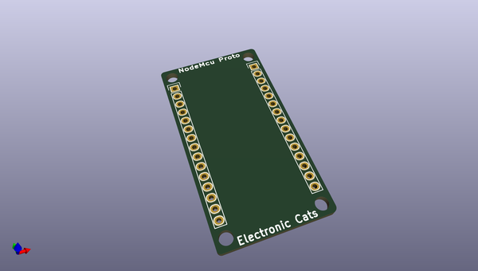
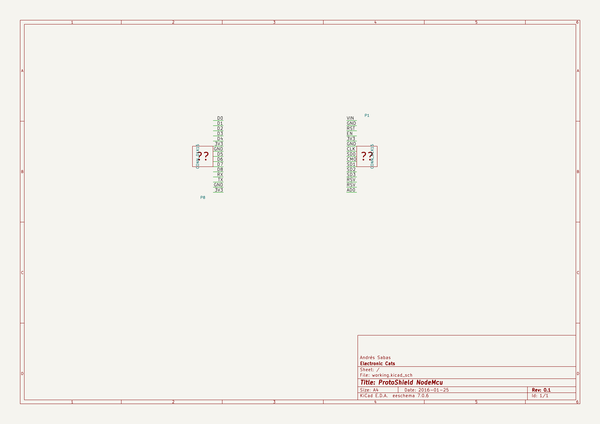

# OOMP Project  
## templateNodeMCU  by ElectronicCats  
  
oomp key: oomp_projects_flat_electroniccats_templatenodemcu  
(snippet of original readme)  
  
- templateNodeMCU  
  
Template in KiCad of shield from NodeMCU 1.0 official  
  
Electronic Cats invests time and resources providing this open source code, please support Electronic Cats and open-source hardware by purchasing products from Electronic Cats!  
  
Designed by Electronic Cats. CERN Open Hardware Licence 1.2 (CERN OHL 1.2), check cern_ohl_v_1_2.txt for more information All text above must be included in any redistribution  
  
  full source readme at [readme_src.md](readme_src.md)  
  
source repo at: [https://github.com/ElectronicCats/templateNodeMCU](https://github.com/ElectronicCats/templateNodeMCU)  
## Board  
  
  
## Schematic  
  
  
  
[schematic pdf](working_schematic.pdf)  
## Images  
