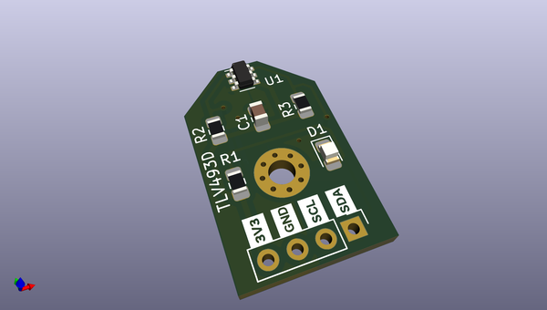
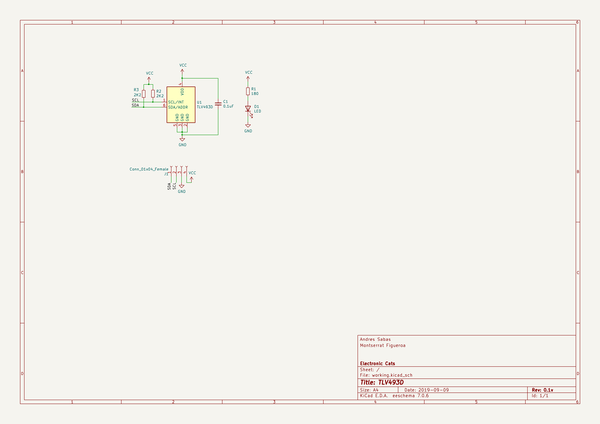

# OOMP Project  
## TLV493D-Croquette  by ElectronicCats  
  
oomp key: oomp_projects_flat_electroniccats_tlv493d_croquette  
(snippet of original readme)  
  
- Electronic Cats Croquette TLV493D  
  
  
  
The 3D magnetic sensor TLV493D-A1B6 offers accurate three-dimensional sensing with extremely low power consumption in a small 6-pin package. With its magnetic field detection in x, y, and z-direction the sensor reliably measures three-dimensional, linear and rotation movements. Applications include joysticks, control elements (white goods, multifunction knops), or electric meters (anti tampering) and any other application that requires accurate angular measurements or low power consumptions.  
The integrated temperature sensor can furthermore be used for plausibility checks.  
  
Key features are 3D magnetic sensing with a very low power consumption during operations. The sensor has a digital output via 2-wire based standard I2C interface up to 1 MBit/sec and 12 bit data resolution for each measurement direction (Bx, By and Bz linear field measurement up to +-130mT).  
  
-- Key Features and Benefits  
* Integrated temperature sensing  
* Low current consumption of 0.007 µA in power down mode and 10 µA in ultra low power mode  
* 2.7 to 3.5 V operating supply voltage  
* Digital output via 2-wire standard I2C interface  
* Bx, By and Bz linear field measurement up to ±130 mT  
* 12-bit data resolution for each measurement direction  
* Resolution 98 µT/LSB  
* Operating temperature range from -40 °C to 125 °  
  full source readme at [readme_src.md](readme_src.md)  
  
source repo at: [https://github.com/ElectronicCats/TLV493D-Croquette](https://github.com/ElectronicCats/TLV493D-Croquette)  
## Board  
  
  
## Schematic  
  
  
  
[schematic pdf](working_schematic.pdf)  
## Images  
