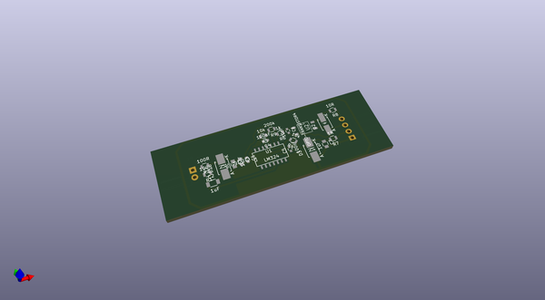
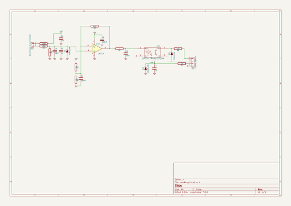

# OOMP Project  
## Kantentaster  by ep092  
  
oomp key: oomp_projects_flat_ep092_kantentaster  
(snippet of original readme)  
  
- Kantentaster  
Adapterplatine zum Anschluss eines Renishaw TP2 5W Kantentasters an USB CNC  
  
Aktueller Stand:  
Prototyp funktioniert  
  
TODO:  
Mit der Steuerung bzw. dem Werkzeuglängentaster verdrahten  
  
  full source readme at [readme_src.md](readme_src.md)  
  
source repo at: [https://github.com/ep092/Kantentaster](https://github.com/ep092/Kantentaster)  
## Board  
  
  
## Schematic  
  
  
  
[schematic pdf](working_schematic.pdf)  
## Images  
