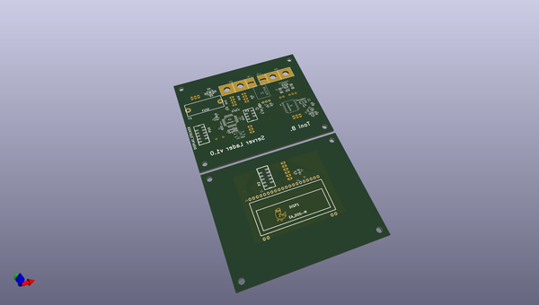
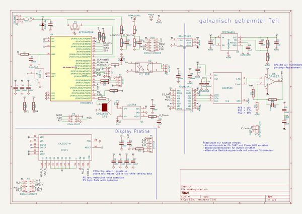

# OOMP Project  
## server_lader  by ep092  
  
oomp key: oomp_projects_flat_ep092_server_lader  
(snippet of original readme)  
  
- server_lader  
  
-- Umbau eines ESP120 zu einem Ladegerät  
  
--- Trivia:  
Das ESP120 ist ein 3kW starkes Servernetzteil mit einer Ausgangsspannung von standardmäßig 52V und bis zu >50A. Das Netzteil lässt sich allerdings leicht auf andere Spannungen umrüsten, um z.B. als Akkulader oder sehr potentes Labornetzteil eingesetzt zu werden.  
  
  
--- Was tut dieses Projekt?  
dieses Projekt soll die zur Spannungsverstellung nötige Hilfsspannung aus den vom Netzteil zusätzlich bereitgestellten 5V erzeugen, die Ausgangsspannung regeln und für einen Ladestrom nach einem Ladeprogramm, das extern eingespeist wird, einstellen. Das Netzteil muss nur minimal gemoddet werden.  
  
  
--- Der Mod:  
siehe elweb, eigene Bilder liegen im Unterordner "Bilder".  
Einfach gesagt, werden an den beiden Pads des Potis "RV..." Kabel angelötet, die dann mit der Steuerplatine verbunden werden. Hier wird die Sollwertspannung eingespeist.  
  
Es existieren Messwerte für 3 Sollwertspannungen:  
  
* 61V 35,4 kOhm (-1,5V am Poti)  
* 60V 42,5 kOhm (-1,3V am Poti)  
* 59V 51,6 kOhm (-1,1V am Poti)  
  
  
-- Umbau auf eine andere Spannung für die Überspannungsabschaltung  
Das Netzteil besitzt zusätzlich zur Regelspannung, die am Poti zu verändern ist, eine feste Spannung, bei der eine Überspannungsabschaltung stattfindet. Die soll das Netzteil und die angeschlossenen Verbraucher schützen. Teilweise ist es jedoch nötig, nahe an 60V zu kommen, beispielsweise, wenn man einen 48V-Bleiakkupack laden will. Daher ist in diesen Fällen die Überspannungs  
  full source readme at [readme_src.md](readme_src.md)  
  
source repo at: [https://github.com/ep092/server_lader](https://github.com/ep092/server_lader)  
## Board  
  
  
## Schematic  
  
  
  
[schematic pdf](working_schematic.pdf)  
## Images  
