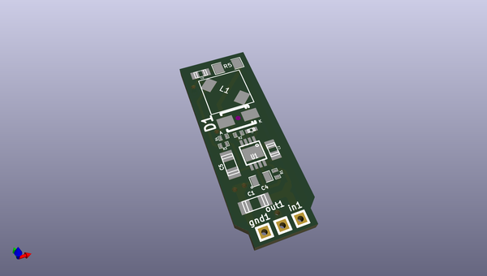
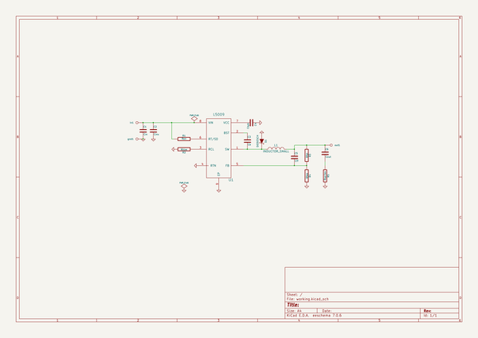

# OOMP Project  
## stepdown_100V_to_15V_150mA  by ep092  
  
oomp key: oomp_projects_flat_ep092_stepdown_100v_to_15v_150ma  
(snippet of original readme)  
  
stepdown_100V_to_15V_150mA  
==========================  
  
 Stepdown from 100V to 15V based on L5009 from Ti   
  
Footprint of IC is wrong  
  
  full source readme at [readme_src.md](readme_src.md)  
  
source repo at: [https://github.com/ep092/stepdown_100V_to_15V_150mA](https://github.com/ep092/stepdown_100V_to_15V_150mA)  
## Board  
  
  
## Schematic  
  
  
  
[schematic pdf](working_schematic.pdf)  
## Images  
