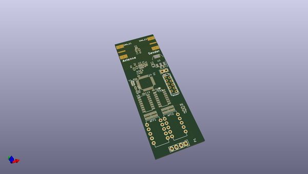
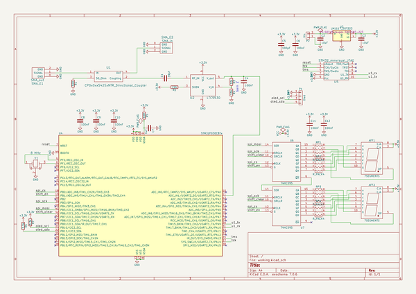

# OOMP Project  
## SWR-Meter  by ep092  
  
oomp key: oomp_projects_flat_ep092_swr_meter  
(snippet of original readme)  
  
- SWR-Meter  
The goal is a SWR-Meter to analyse Antennas from 2,4GHz to 5,8GHz e.g. for FPV-Antennas.  
The module ist based on a directional coupler (AVX CP0603Q5425ENTR) and a power detector (LMH2110).   
A uC (Atmel oder STM32F0) reads in the voltage with it's ADC and shows the results.  
  
  
  full source readme at [readme_src.md](readme_src.md)  
  
source repo at: [https://github.com/ep092/SWR-Meter](https://github.com/ep092/SWR-Meter)  
## Board  
  
  
## Schematic  
  
  
  
[schematic pdf](working_schematic.pdf)  
## Images  
