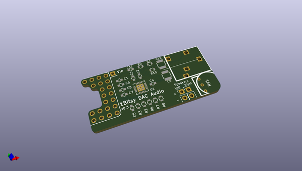
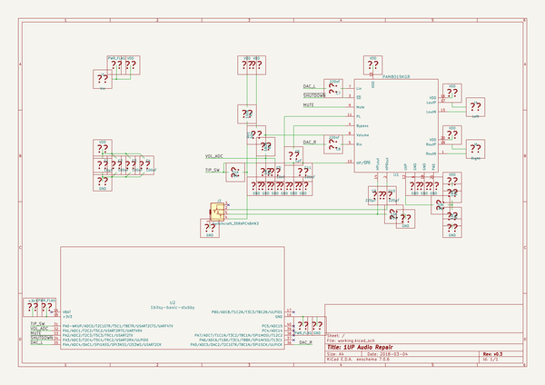

# OOMP Project  
## 1up-audio-repair  by esden  
  
(snippet of original readme)  
  
- Repair a 1UP's headphone jack.  
  
This is a prototype of the  
[1Bitsy-1UP](https://github.com/1Bitsy/1bitsy-1up)'s new audio output  
section.  It is being implemented as a daughter card, but if it works,  
it will be integrated into a future version of the 1Up  
  
  
-- Objectives  
  
The new audio section will have these features.  
  
 * Stereo headphone out or mono speaker out.  
  
* Automatic switching between speaker and headphone when 'phones are  
   plugged in.  
  
* Thumbwheel for volume control.  
  
* The volume wheel will directly control audio gain, but will also be  
  readable by software.  
  
* Headphone presence will directly control audio signal routing, but  
  will also be readable by software. Software will produce stereo  
  signal when the headphones are active and mono signal when the  
  speaker is active.  
  
* The amplifier's mute function will be controllable by software.  
  
* The amplifier's shutdown (low power) function will be controllable  
* by software.  
  
  
-- The Design  
  
The audio output will be built around the PAM8019 amplifier from  
Diodes Incorporated.  Headphone outputs will be routed to a 3.5mm  
headphone jack.  Speaker outputs will be routed to a terminal block  
for an off-board speaker.  
  
The board will be configurable to take power either from the 1Bitsy's  
+3v3 rail or from a separate power connection.  
  
  
-- Considerations  
  
This is speculation based on the PAM8019 datasheet.  
  
The 8019's digital input pins, MUTE and ~SD, are 3V compatible.  When  
the 8019 is at 5V, a 3.3V GPIO will cont  
  full source readme at [readme_src.md](readme_src.md)  
  
source repo at: [https://github.com/esden/1up-audio-repair](https://github.com/esden/1up-audio-repair)  
## Board  
  
  
## Schematic  
  
  
  
[schematic pdf](working_schematic.pdf)  
## Images  
