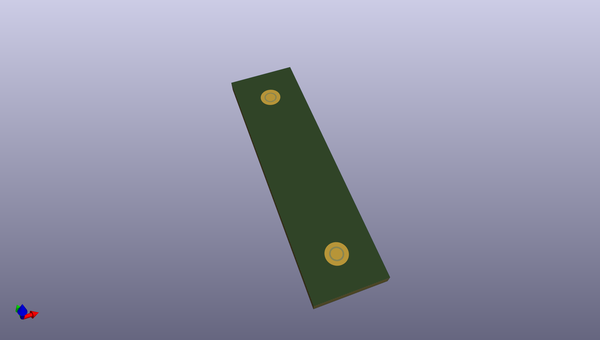
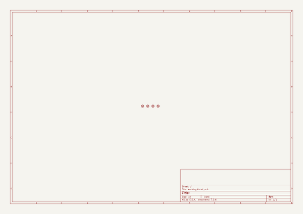

# OOMP Project  
## floss-jtag  by esden  
  
oomp key: oomp_projects_flat_esden_floss_jtag  
(snippet of original readme)  
  
Free Libre Open-Source/-Hardware JTAG/UART Adapter based on the FT2232H chip.  
  
The hardware is licensed under Creative Commons Share Alike By Attribution 3.0 (CC-BY-SA 3.0)  
  
Copyright 2009-2010 Piotr Esden-Tempski  
  
- UART connector adapter side:  
  
| Pin No. | Name  |  
|---------|-------|  
| 1       | +3.3V |  
| 2       |  TXD  |  
| 3       |  RXD  |  
| 4       |  GND  |  
  
The numbering of the connector is from left to right when looking from the edge  
of the board at the pins of the header.  
  
- Hardware design file notes:  
  
All designs up until version 1.0 of Floss-JTAG were  
designed in Cadsoft EAGLE. To view the files you will need to install EAGLE.  
Most of the designs are 4-layer; this means that you will need a paid version  
of the software to edit the inner layers of the board.  
  
  
  
  full source readme at [readme_src.md](readme_src.md)  
  
source repo at: [https://github.com/esden/floss-jtag](https://github.com/esden/floss-jtag)  
## Board  
  
  
## Schematic  
  
  
  
[schematic pdf](working_schematic.pdf)  
## Images  
