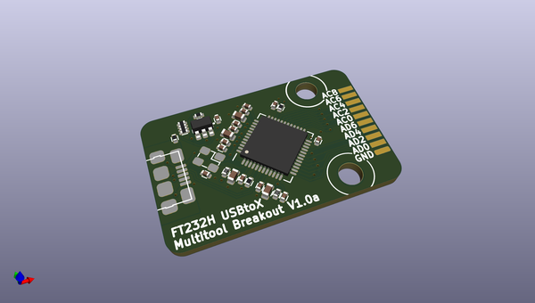
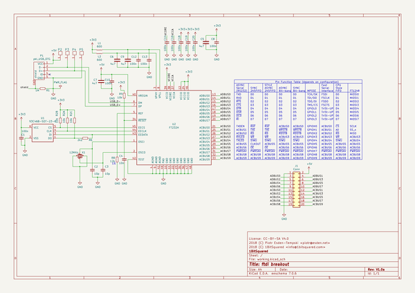

# OOMP Project  
## ftdi-multitool  by esden  
  
oomp key: oomp_projects_flat_esden_ftdi_multitool  
(snippet of original readme)  
  
This repository contains hardware designs for an FTDI FT232H based multi purpose tool.  
  
The design goal is to make a very small FTDI breakout board that has a defined connector. That defined connector can receive a wide range of easy to design adapters. The adapters can then plug in into any variety of targets. The FTDI chip has a fairly wide range of protocols it supports, making it ideal for many applications.  
  
-- Protocol List  
* TTY UART Serial (with or without hardware flow control)  
* SPI using MPSSEngine  
* I2C  
* JTAG  
* CPU Data Address  
  
-- Datasheet  
For more information on the FTDI FT232 please refer to the chip's [datasheet](http://www.ftdichip.com/Support/Documents/DataSheets/ICs/DS_FT232H.pdf).  
  
  full source readme at [readme_src.md](readme_src.md)  
  
source repo at: [https://github.com/esden/ftdi-multitool](https://github.com/esden/ftdi-multitool)  
## Board  
  
  
## Schematic  
  
  
  
[schematic pdf](working_schematic.pdf)  
## Images  
