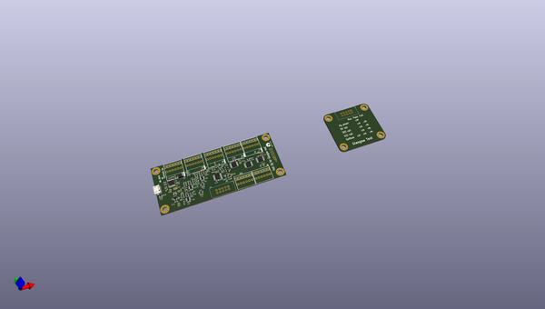

# OOMP Project  
## Glasgow  by esden  
  
(snippet of original readme)  
  
- Glasgow Debug Tool  
  
**Want one? The [Crowdsupply campaign](https://www.crowdsupply.com/1bitsquared/glasgow) is now live.**  
  
**Let's chat! Our IRC channel is [-glasgow at freenode.net](https://webchat.freenode.net/?channels=glasgow); our Discord channel is [-glasgow at 1BitSquared's Discord server](https://1bitsquared.com/pages/chat).**  
  
**Important note: if you are looking to assemble boards yourself, use only revC1.**  
  
-- What is Glasgow?  
  
Glasgow is a tool for exploring digital interfaces, aimed at embedded developers, reverse engineers, digital archivists, electronics hobbyists, and everyone else who wants to communicate to a wide selection of digital devices with high reliability and minimum hassle. It can be attached to most devices without additional active or passive components, and includes extensive protection from unexpected conditions and operator error.  
  
The Glasgow hardware can support many digital interfaces because it uses reconfigurable logic. Instead of only offering a small selection of standard hardware supported interfaces, it uses an FPGA to adapt on the fly to the task at hand without compromising on performance or reliability, even for unusual, custom or obsolete interfaces.  
  
The Glasgow software is a set of building blocks designed to eliminate incidental complexity. Each interface is packaged into a self-contained *applet* that can be used directly from the command line, or reused as a part of a more complex system. Using Glasgow does not require an  
  full source readme at [readme_src.md](readme_src.md)  
  
source repo at: [https://github.com/esden/Glasgow](https://github.com/esden/Glasgow)  
## Board  
  
  
## Schematic  
  
  
  
[schematic pdf](working_schematic.pdf)  
## Images  
