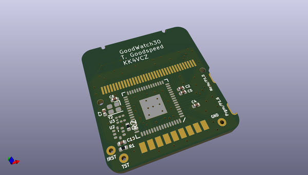
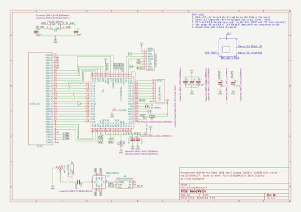

# OOMP Project  
## goodwatch  by esden  
  
oomp key: oomp_projects_flat_esden_goodwatch  
(snippet of original readme)  
  
Howdy y'all,  
  
This is a side project of mine to build a replacement circuit board  
for the Casio 3208 module, used in the Casio CA-53W and CA-506  
calculator watches.  It is not compatible with the 3228 module used in  
the Databank watches, which have four external buttons instead of two.  
As a side project, it has no warranty whatsoever and you shouldn't use  
it for anything.  
  
In the rare case that you find this project to be useful, you owe me a  
pint of good, hoppy pale ale.  All license to use this project is  
revoked if you try to pass off a pilsner instead.  
  
In addition to the source code, there is handy documentation in the  
[wiki](https://github.com/travisgoodspeed/goodwatch/wiki) and a  
general interest website at [goodwatch.org](https://goodwatch.org/).  
  
73 from Knoxville,  
  
--Travis  
  
-- Software Status  
  
Our firmware is freely available in this repository, compiling with  
the standard MSP430 compiler packages that ship with Debian.  It  
consists of a Clock, a Stopwatch, an RPN Calculator, and a Hex Memory  
Viewer with Disassembler, all written in C.  It compiles in Debian  
with all of the MSP430 packages installed.  
  
On watches with a radio, we have Morse and GFSK transmitters, as well  
as an OOK transmitter that will command cheap remote-controlled  
relays.  The radio is accessible from a host computer over the UART  
for building base stations and repeaters, or for rapidly prototyping  
radio applications in Python.  P25 and DMR support might come soon.  
  
Additionally, we've written ou  
  full source readme at [readme_src.md](readme_src.md)  
  
source repo at: [https://github.com/esden/goodwatch](https://github.com/esden/goodwatch)  
## Board  
  
  
## Schematic  
  
  
  
[schematic pdf](working_schematic.pdf)  
## Images  
