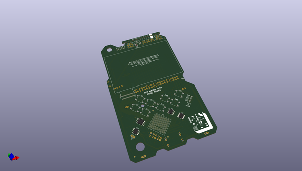
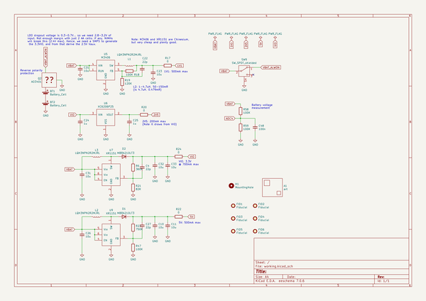

# OOMP Project  
## hadbadge2019_pcb  by esden  
  
oomp key: oomp_projects_flat_esden_hadbadge2019_pcb  
(snippet of original readme)  
  
Hackaday Supercon 2019 Badge: PCB/schematics  
============================================  
  
This repo contains the schematics and PCB artwork for the Hackaday Supercon 2019 badge. It isn't  
as cleaned up yet as I want to be, but I hope it works as a reference. Note that there may be some  
older text and other files floating around in the repo as well.  
  
Known Issues  
------------  
  
There are some issues with the final release on the badge. They are collected here. If you find more,  
feel free to open an issue.  
  
* The PMOD connector I/O pins are reversed in contrast with the actual PMOD specification. As the  
Vcc and GND pins are not affected, the connector is still PMOD-compatible. Only the badge silkscreen  
and the schematics have the wrong pinout, the SoC and software is correct.   
(Ref [here](https://github.com/Spritetm/hadbadge2019_fpgasoc/issues/18) )  
  
* The SAO connector is messed up: the SCL/SDA lines as well as GPIO1/GPIO2 are swapped. Both the net  
names in the schematic as well as the silkscreen legend have this issue. Again, as Gnd and Vcc are in  
the correct locations, this does not influence the functionality.  
  
* The 8MHz clock oscillator is routed to a non-clock-capable GPIO. While Yosys/Nextpnr doesn't  
have any real issues with this, the official lattice Diamond software will refuse to use this  
as a clock pin. As a workaround, you may be able to route it to a clock-capable free pin, then use  
the input from that pin as a clock. (Ref [here](https://github.com/Spritetm/hadbad  
  full source readme at [readme_src.md](readme_src.md)  
  
source repo at: [https://github.com/esden/hadbadge2019_pcb](https://github.com/esden/hadbadge2019_pcb)  
## Board  
  
  
## Schematic  
  
  
  
[schematic pdf](working_schematic.pdf)  
## Images  
