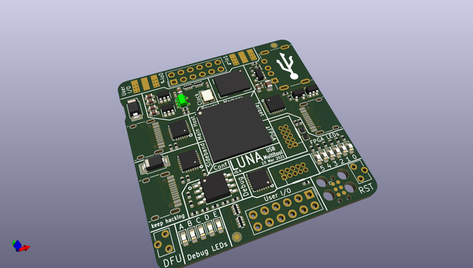
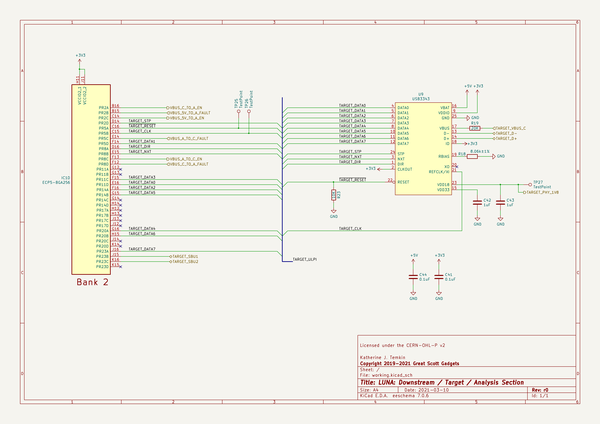

# OOMP Project  
## luna  by esden  
  
(snippet of original readme)  
  
  
- LUNA: a USB multitool & nMigen library    
  
  
  
-- LUNA Library  
  
LUNA is a full toolkit for working with USB using FPGA technology; and provides hardware, gateware, and software to enable USB applications.  
  
Some things you can use LUNA for, currently:  
  
- **Protocol analysis for Low-, Full-, or High- speed USB.** LUNA provides both hardware designs and gateware that allow passive USB monitoring. When combined with the [ViewSB](https://github.com/usb-tools/viewsb) USB analyzer  
  toolkit, LUNA hardware+gateware can be used as a full-featured USB analyzer.  
- **Creating your own Low-, Full-, High-, or (experimentally) Super- speed USB device.** LUNA provides a collection of nMigen gateware that allows you to easily create USB devices in gateware, software, or a combination of the two.  
- **Building USB functionality into a new or existing System-on-a-Chip (SoC).** LUNA is capable of generating custom peripherals targeting the common Wishbone bus; allowing it to easily be integrated into SoC designs; and the library provides simple automation for developing simple SoC designs.  
  
Some things you'll be able to use LUNA for in the future:  
  
- **Man-in-the-middle'ing USB communications.** The LUNA toolki  
  full source readme at [readme_src.md](readme_src.md)  
  
source repo at: [https://github.com/esden/luna](https://github.com/esden/luna)  
## Board  
  
  
## Schematic  
  
  
  
[schematic pdf](working_schematic.pdf)  
## Images  
