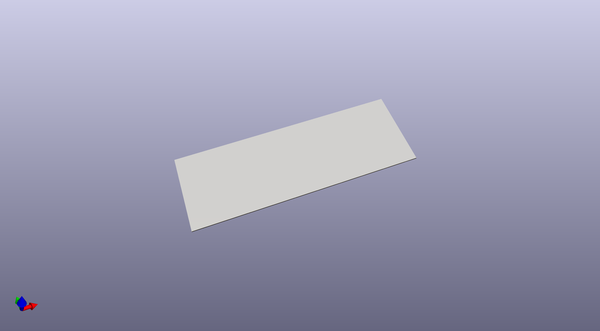

# OOMP Project  
## mchf-rf-shield  by esden  
  
oomp key: oomp_projects_flat_esden_mchf_rf_shield  
(snippet of original readme)  
  
This repository contains a KiCad design file for a replacement [mcHF QRP  
radio](http://www.m0nka.co.uk/) RF Shield.  
  
This RF shield is meant for the V0.6.3 PCB set of the [mcHF QRP  
radio](http://www.m0nka.co.uk/) when using the aliexpress metal enclosure.  
  
The RF shield included with the aliexpress enclosures does not fit the V0.6.3  
perfectly and needs to be adjusted manually. As services like SendCutSend and  
OSHCut are very affordable these days it is possible to order laser cut  
replacement RF shield that will perfectly fit without the need for manual  
adjustment.  
  
If you find that this shield is not fitting exactly or you have improvement  
suggestions feel free to send in a pull request. The [KiCad  
software](https://www.kicad.org/) is free and easy to use to make adjustments  
to the design.  
  
  full source readme at [readme_src.md](readme_src.md)  
  
source repo at: [https://github.com/esden/mchf-rf-shield](https://github.com/esden/mchf-rf-shield)  
## Board  
  
  
## Schematic  
  
  
  
[schematic pdf](working_schematic.pdf)  
## Images  
