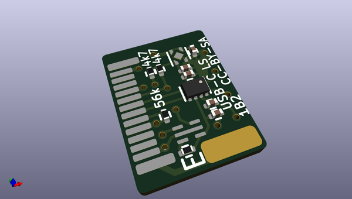
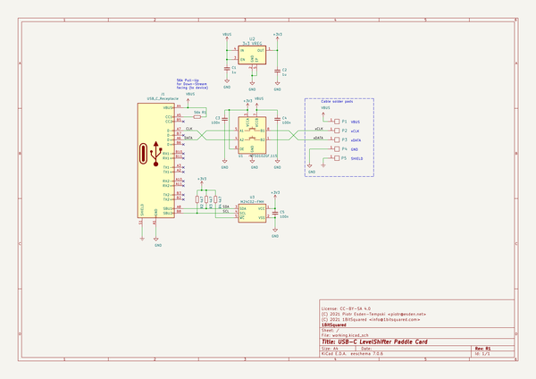

# OOMP Project  
## usb-cable  by esden  
  
(snippet of original readme)  
  
This repository contains random board designs related to USB cables.  
  
  
  full source readme at [readme_src.md](readme_src.md)  
  
source repo at: [https://github.com/esden/usb-cable](https://github.com/esden/usb-cable)  
## Board  
  
  
## Schematic  
  
  
  
[schematic pdf](working_schematic.pdf)  
## Images  
