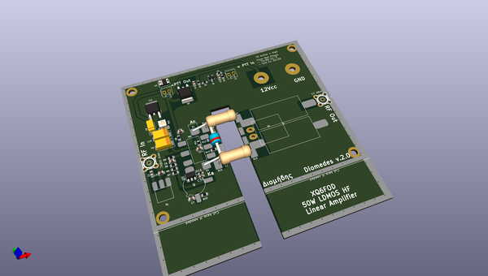
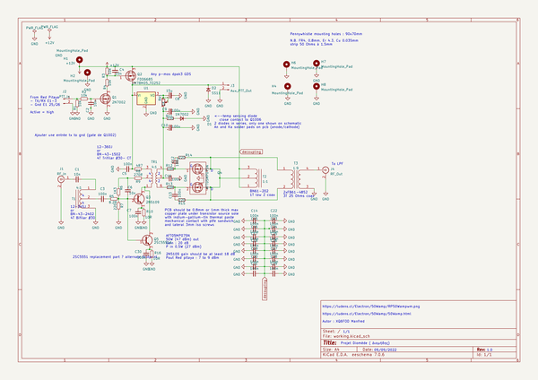
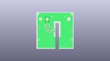
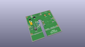
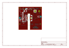
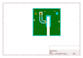
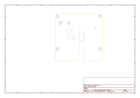
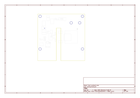
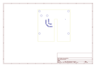
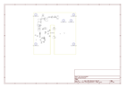

# OOMP Project  
## 50W_RF_Amp  by F6ITU  
  
oomp key: oomp_projects_flat_f6itu_50w_rf_amp  
(snippet of original readme)  
  
- 50W_RF_Amp, Codename Diomedes  
  
Diomedes is a 47 dBm (50W) HF amplifier designed by Manfred XQ6FOD, and intended to be used with any baseband SDR delivering no more than 5 to 10 dBm of  output power between 1 and 54 MHz.   
  
  
  
The original schematic of this project   
  
  
https://ludens.cl/Electron/50Wamp/RP50Wampwm.png  
  
as well as the assembly instructions are available at the following URL  
  
https://ludens.cl/Electron/50Wamp/50Wamp.html  
  
This github repository only serves to simplify the work of people who want to build this amplifier. It offers  them the Gerber files and the KiCad implementation of this project.  
  
Thank you, Manfred, for the many developments you’ve done around the Red Pitaya board, and especially for your work on the EER support. It’s a « must read »… at least.  
  
  
This amplifier is designed to follow a 14 or 16 bit Red Pitaya board or any barefoot DDC/DUC SDR board. It completes the series of devices constituting the Alexiares frontend developed by the OpenHPSDR group  
  
https://wiki.electrolab.fr/Projets:Lab:2017:Peripheriques_Angelia  
  
and replaces advantageously the old and outdated  Pennywhistle linear amplifier   
  
https://openhpsdr.org/pennywhistle.php  
  
It should be noted that board's dimensions and mounting holes are completely compatible with Pennywhistle physical and mechanical design. In fact, Diomedes has been designed as a substitute amplifier.   
The onl  
  full source readme at [readme_src.md](readme_src.md)  
  
source repo at: [https://github.com/F6ITU/50W_RF_Amp](https://github.com/F6ITU/50W_RF_Amp)  
## Board  
  
  
## Schematic  
  
  
  
[schematic pdf](working_schematic.pdf)  
## Images  
  
  
  
  
  
  
  
  
  
  
  
  
  
  
  
  
