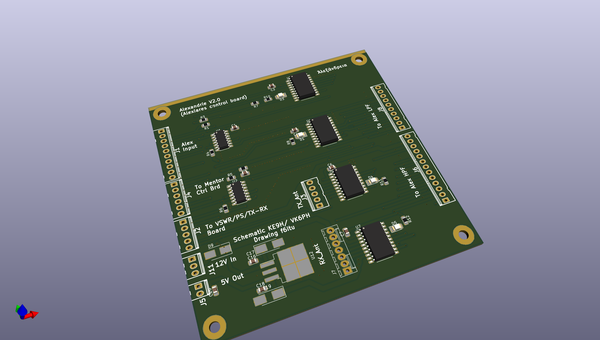
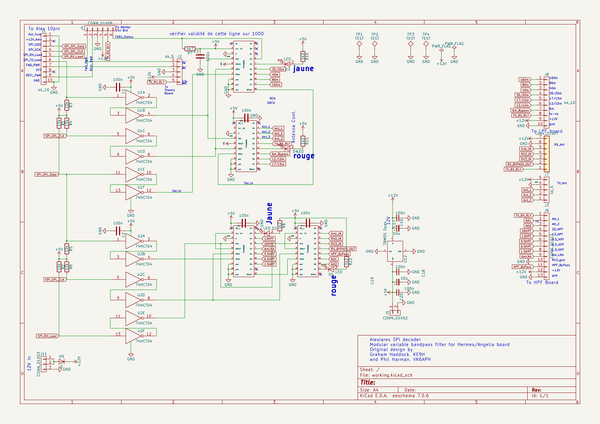
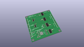
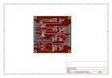
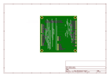
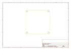
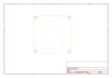
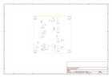

# OOMP Project  
## Alexandrie  by F6ITU  
  
(snippet of original readme)  
  
- Alexandrie  
  
Kicad files  
  
Control board for Alexiares filter set  
  
THIS PROJECT IS DEPRECATED.  
  
PSE USE ALEXV2 INSTEAD 5https://github.com/F6ITU/AlexV2°  
  
This work is protected by the TAPR Open Hardware Licence https://www.tapr.org/ohl.html  
  
Original work by Graham Haddock, KE9H and Phil Harman, VK6APH.  
  
This board supports the SPI "Alexiares" protocol (also called "J16") of   
the original Hermes SDR board designed by the OpenHPSDR group.  
  
As Alexiares was not sold anymore by the TAPR, a new and more "modular"   
design was needed by many hams wishing to play with OpenHPSDR plateforms  
(Homebrewed Hermes or Angelia boards, Steve KF7O's Hermes Lite, Red Pitaya   
supporting Pavel Denim's firmware... )   
  
Alexandrie is only needed by people using an original   
Hermes Board or a Red Pitaya (via the SPI output)  
  
A specific replacement board (Alexi2C) has been design for   
  
* Hermes, Angelia, Odyssey2, HiQSDR boards  
*  Red Pitaya owners using the I2C output  
  
3D image of the board are stored on this repo  
  
Alexandrie dwn.jpg  
  
Alexandrie up.jpg  
  
  
Board's dimensions are oversized to fit the 5x10 and 10x10cm   
size of all board of the Hermes project under Kicad:   
  
AlexI2C  
  
Alexandrie (this one)  
  
Alexiares_Coax_Out  
  
Alexiares_HPF  
  
Alexiares_LPF  
  
Mentor  
  
  
  full source readme at [readme_src.md](readme_src.md)  
  
source repo at: [https://github.com/F6ITU/Alexandrie](https://github.com/F6ITU/Alexandrie)  
## Board  
  
  
## Schematic  
  
  
  
[schematic pdf](working_schematic.pdf)  
## Images  
  
  
  
  
  
  
  
  
  
  
  
  
  
  
  
  
