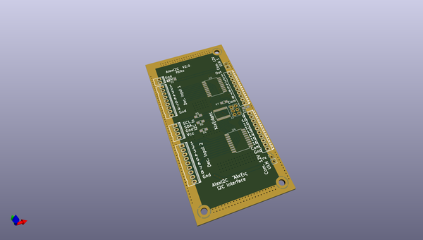
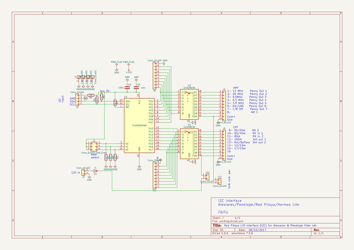

# OOMP Project  
## Alexi2C  by F6ITU  
  
(snippet of original readme)  
  
- Alexi2C  
  
Kicad files  
  
I2C control board interfacing   
Alexiares/Penelope input/output filter set   
with Hermes Lite 2.x & Red Pitaya   
  
It could also be used with a decimal/7 bits binary input for   
Hermes lite 1.0   
  
http://www.hermeslite.com/  
  
This board is a fork of the DC2PD interface for the Red Pitaya  
http://rz1zr.ru/files/Hermes_and_Alex_outputs.pdf  
  
It has  
been designed to   
  
- Control a set of Alexiares LPF and HPF filters  
using the Hermes lite or Red Pitaya's I2C output (Steve KF7O or Pavel Denim's firmware).  
http://pavel-demin.github.io/red-pitaya-notes/sdr-transceiver-hpsdr/  
  
  
- Control a simple BCD or decimal filter (J6 output of an Hermes Lite)  
In this case, the TCA9555 and the 5 pins "I2C Input" connector are not used  
  
 === Hardware modifications===  
  
A set of darlington (ULN2803) is used to fit the voltage   
and current requirement of both lpf and hpf boards.   
  
A pair of jumpers located close to the output connectors   
allow to use the "local" 12V  power rail if set,   
or any external voltage when opened.   
  
For hams using this board with the KF7O's Hermes Lite V1 (deprecated dev.), two connectors   
have been added to directly control the drivers in decimal mode,  
thus to control a Penelope, Alexiares or an Alex SV1AL softrock based   
"Big Mobo" filter set ( or any filter   
board using negative logic band switching)   
  
Please note that the antenna and attenuator commands need a separate   
board if an Alex lpf/hpf filter set is already used (Pavel's firmware).   
  
An antenna sw  
  full source readme at [readme_src.md](readme_src.md)  
  
source repo at: [https://github.com/F6ITU/Alexi2C](https://github.com/F6ITU/Alexi2C)  
## Board  
  
  
## Schematic  
  
  
  
[schematic pdf](working_schematic.pdf)  
## Images  
