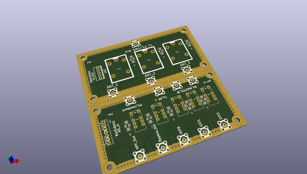
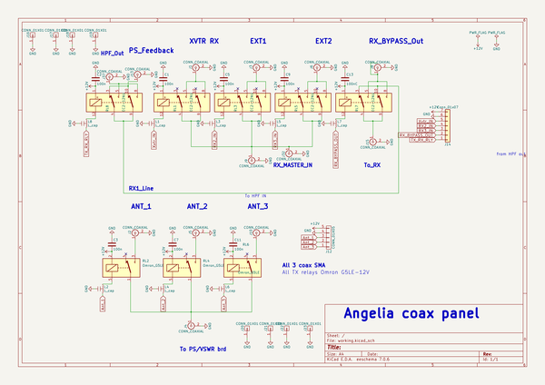

# OOMP Project  
## Alexiares_Coax_Out  by F6ITU  
  
oomp key: oomp_projects_flat_f6itu_alexiares_coax_out  
(snippet of original readme)  
  
- Alexiares_Coax_Out Master  
  
Kicad files  
  
OpenHPSDR RX and TX rear panel crowbar (coax input and output)  
  
---Branch Master  
-----------  
  
  Please do NOT use this repository.  
  Master is the main development trunk and, for this reason,   
  is in a perpetual unstable state. Use the last branch instead  
-----------  
  
For more informations, please refer to   
  
https://wiki.electrolab.fr/Projets:Lab:2017:Peripheriques_Angelia  
  
This board could be cut in half and shielded  
  
Input are fully compatible with Alexiares/Alexandrie output  
  
TX antenna relays are rated at 150 W PEP (300 W maximum)  
  
It also could work with DC2PD I2C interface   
and it's forked version AlexI2C  
  
3D image of the board are stored on this repo  
  
RX_Ant dwn.jpg  
  
RX_Ant_up.jpg  
  
  
Bom is available in CSV format  
  
Schematics, pcb design, modules and libs are in Kicad format  
  
Gerber files are fully compatible with Protel 4.6 format  
  
Board's dimensions are oversized to fit the 5x10 and 10x10cm   
  
size of all board of the Hermes project under Kicad:   
  
* Alexandrie (Ἀλεξάνδρεια), Alexiares SPI interface  
* Alexi2C ( Ἄλεξις), Alternate Alexiares I2C interface  
* Alexiares_lpf (Ἀλεξιάρης) Alexiares low pass filter  
* Alexiares_hpf (Ἀλεξιάρης) Alexiares high-pass filter  
* Alexiares_Coax_Out (Ἀλεξιάρης ) Alexiares antenna switch boards  
* Télémaque (Τηλέμαχος),  SSPA U/V/C°/Refl/FWD sensor for the Mentor board   
* Mentor (Μέντωρ) Micro-controler unit(MCU) and security module controling Telemaque informations  
* Ulysse ou Odysseus (Ὀδυσσεύς),  
  full source readme at [readme_src.md](readme_src.md)  
  
source repo at: [https://github.com/F6ITU/Alexiares_Coax_Out](https://github.com/F6ITU/Alexiares_Coax_Out)  
## Board  
  
  
## Schematic  
  
  
  
[schematic pdf](working_schematic.pdf)  
## Images  
