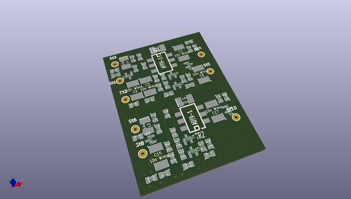
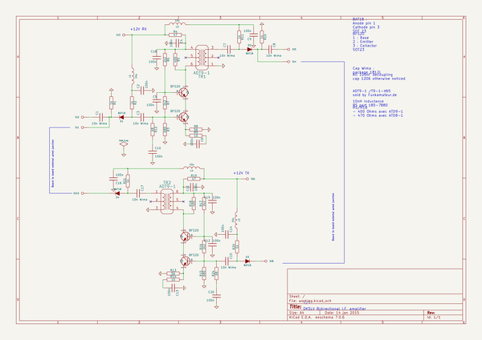

# OOMP Project  
## ampli-bidi  by F6ITU  
  
oomp key: oomp_projects_flat_f6itu_ampli_bidi  
(snippet of original readme)  
  
- ampli-bidi  
A 50/50 Ohm 3dB gain low noise  bidirectional 10.7 MHz amplifier  
  
  
This bidirectionnal amplifier has been developped by DK5LV to enhance the input stage of an IF amplifier.   
Description (in French) could be found at   
https://wiki.electrolab.fr/Projets:Lab:2011:Picastar-Modification_de_l.E2.80.99.C3.A9tage_d.E2.80.99adaptation_d.E2.80.99imp.C3.A9dance_du_filtre_.C3.A0_quartz  
  
  full source readme at [readme_src.md](readme_src.md)  
  
source repo at: [https://github.com/F6ITU/ampli-bidi](https://github.com/F6ITU/ampli-bidi)  
## Board  
  
  
## Schematic  
  
  
  
[schematic pdf](working_schematic.pdf)  
## Images  
