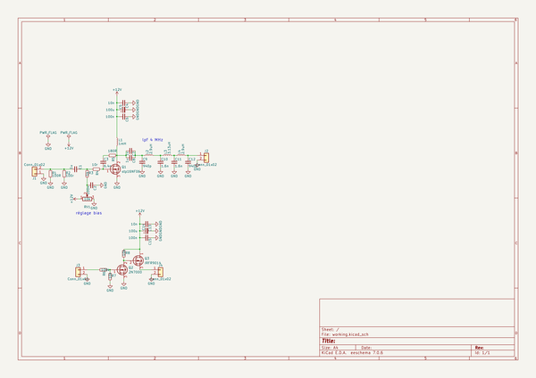

# OOMP Project  
## ampli_FET  by F6ITU  
  
oomp key: oomp_projects_flat_f6itu_ampli_fet  
(snippet of original readme)  
  
- ampli_FET  
General purpose small N-Fet amp   
  
  full source readme at [readme_src.md](readme_src.md)  
  
source repo at: [https://github.com/F6ITU/ampli_FET](https://github.com/F6ITU/ampli_FET)  
## Board  
  
  
## Schematic  
  
  
  
[schematic pdf](working_schematic.pdf)  
## Images  
