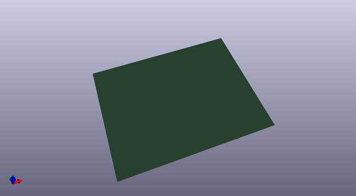
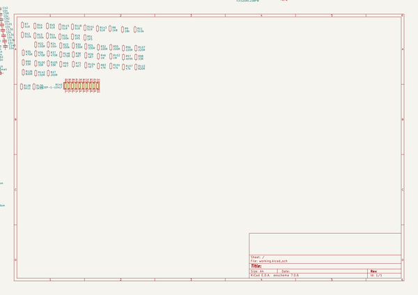

# OOMP Project  
## Angelia_iBom  by F6ITU  
  
oomp key: oomp_projects_flat_f6itu_angelia_ibom  
(snippet of original readme)  
  
- Angelia_iBom  
Kicad iBom for OpenHPSDR Angelia SDR main board (reversing)  
  
  
  
  
This repository is dedicated to all people wishing to home-built the OpenHPSDR Angelia board.   
  
This reversing has been done using the official BOM, the original silkmask and the schematic made by the OpenHPSDR group  
  
As most of HPSDR design have been made with a close source EDA (probably Altium), it was necessary to offer an open hardware kind of help   
to the rare and brave people who had the chance to get a grip on a bare Angelia board  
  
This iBom is not fully documented, obvious component placement have been ommited. Feel free to complete the job if you feel yourself   
brave enough   
  
the 3D picture below gives an idea of the progression  
  
  
  
  
  full source readme at [readme_src.md](readme_src.md)  
  
source repo at: [https://github.com/F6ITU/Angelia_iBom](https://github.com/F6ITU/Angelia_iBom)  
## Board  
  
  
## Schematic  
  
  
  
[schematic pdf](working_schematic.pdf)  
## Images  
