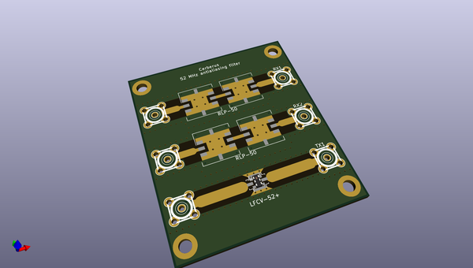
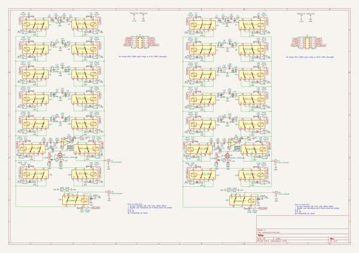
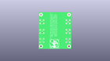
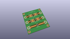
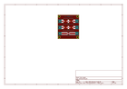
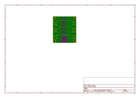
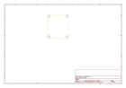
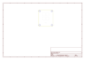
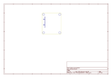
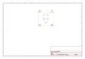

# OOMP Project  
## antialiasing_filter  by F6ITU  
  
oomp key: oomp_projects_flat_f6itu_antialiasing_filter  
(snippet of original readme)  
  
Cerberus, a triple path antialiasing filter for RF Software defined radio  
  
  
  
Cerberus is a simple series of three 52 MHz low pass filters designed to eliminate the second Nyquist zone of any "bare foot"   
120 MSPS baseband software defined HF transceiver. One filter is used in the Transmission path, two distinct filters could be used for   
two different RX path.  
  
A single LTCC filter is dedicated to the TX output able to withstand up to 8W CW. It's rejection level is around 50 dB in the stopband area.  
This filter should be  completed with a post-amplifier low pass filter.   
  
Two RX path (for 2 separated ADCs) are based on a pair of cascaded RLP-50+ low pass filters, thus offering a rejection of 50 dB each  
  
Each of these path could be used with or without an RF preselector (bandpass filter or low pass filter)   
  
This antialiasing frontend should be inserted just after the baseband board (Red Pitaya 14 or 16 bits, IQsdr etc)and before   
the SDR frontend (in other words, a simple bandpass filter, a more complex "Alexiares like" preselector, or a combination of   
Alexiares or entry level filters and a set of high power frontend (Zolotaref lpf, Aries ATU, Munin amplifier etc  
  
  
As usual, this board is under the CERN Open Hardware licence  
  
  
  full source readme at [readme_src.md](readme_src.md)  
  
source repo at: [https://github.com/F6ITU/antialiasing_filter](https://github.com/F6ITU/antialiasing_filter)  
## Board  
  
  
## Schematic  
  
  
  
[schematic pdf](working_schematic.pdf)  
## Images  
  
  
  
  
  
  
  
  
  
  
  
  
  
  
  
  
