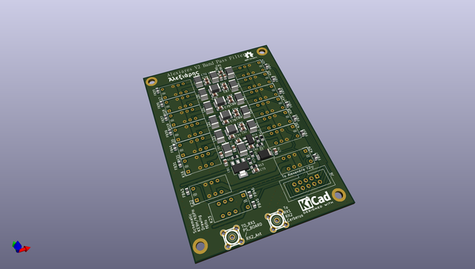
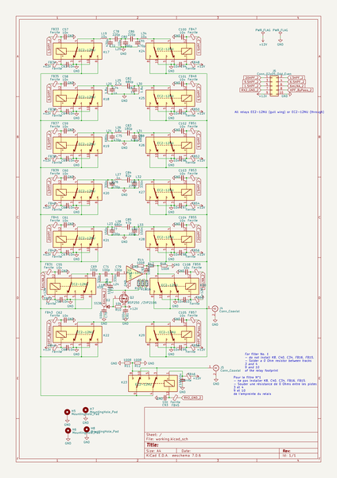
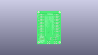
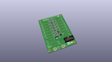
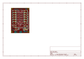
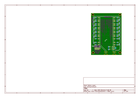
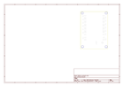
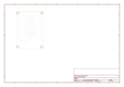
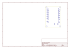
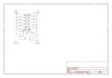

# OOMP Project  
## Dual_BPF  by F6ITU  
  
oomp key: oomp_projects_flat_f6itu_dual_bpf  
(snippet of original readme)  
  
- Alexiares dual BPF for Orion/Anvelina SDR Board  
  
1 to 60 MHz Band pass filter for dual ADC SDR  (Orion class, Anvelina, Red Pitaya)  
  
This pcb serves as RX bandpass for the new generation of Alexiares frontend  
  
  
  
It replace the former Alexiares HPF filter and uses the very same SPI bus protocol  
  
Please note that on BPF1    
  
K23, FB45, FB46, R11, R12, C106 and C93 should NOT be soldered  
  
 (pads 3-10 and 9-4 should be strapped)  
   
Signal RX2_GND is not used  
  
BPF2 should be fully assembled, with K23, FB45, FB46, R11, R12, C106 and C93. Signal RX2_GND should be present on J6  
  
(see Alexandrie V2 wirering )  
  
  
  
  
  full source readme at [readme_src.md](readme_src.md)  
  
source repo at: [https://github.com/F6ITU/Dual_BPF](https://github.com/F6ITU/Dual_BPF)  
## Board  
  
  
## Schematic  
  
  
  
[schematic pdf](working_schematic.pdf)  
## Images  
  
  
  
  
  
  
  
  
  
  
  
  
  
  
  
  
