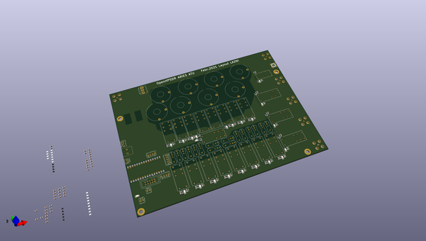
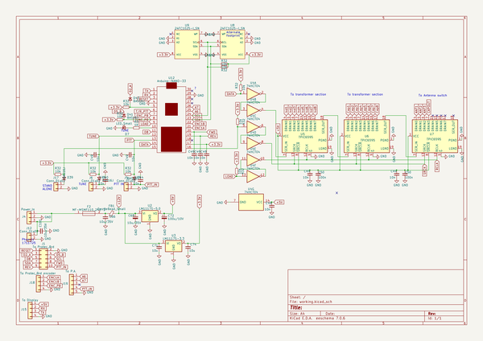

# OOMP Project  
## K_Aries  by F6ITU  
  
oomp key: oomp_projects_flat_f6itu_k_aries  
(snippet of original readme)  
  
- K_Aries  
  
Aries, an OpenHPSDR ATU (kicad version)   
  
The golden fleece ram (Aries in Latin, Chrysomallos -Χρυσόμαλλος- in ancien Greek)   
has been send by Hermes (codename of the first "mono board" OpenHPSDR) to save Phrixos and Hellé.   
After his death, his remains (the golden fleece) was conquered by Jason and the Argonauts  
  
  
  
   
 This repository is a fork of the Aries ATU project designed by Kjell Karlsen LA2NI and Laurence Barker G8NJJ.  
   
 The original work can be downloaded from  
  
https://github.com/LA2NI/  
  
https://github.com/laurencebarker  
  
A French version of the main documentation and user's note could be found in the "Documentation" directory   
(still work in progress)  
  
Main differences are :   
  
* - DIL footprint  for the I2C ram (hard to find in SOIC package)  
* - R19 trace bug corrected  
* - input-output coax connector changed (Amphenol bnc straight with reference)  
* - F-CU ground "forbiden zone" modified around tandem match output (R42-E42-R1-R2 of the original design)  
* - dual footprint for 12V input J4 (Molex kk 2.54mm and Phoenix high current "board to wire" connector)  
* - same Tianbo TRA2 L-12VDC-S-Z relay (or Omron G2R-1-E DC12) used for antenna switch   
( Total relay count is 21 Tinabo TRA2/Omron G2R and 1 G6A-274P-ST-US DC12 now)  
  
  
- Work is RTM  
These files are considered as "ready to manufacture". In other words, Gerber files, iBom and BOM could be downloaded and/or  
sent to a fabhous  
  full source readme at [readme_src.md](readme_src.md)  
  
source repo at: [https://github.com/F6ITU/K_Aries](https://github.com/F6ITU/K_Aries)  
## Board  
  
  
## Schematic  
  
  
  
[schematic pdf](working_schematic.pdf)  
## Images  
