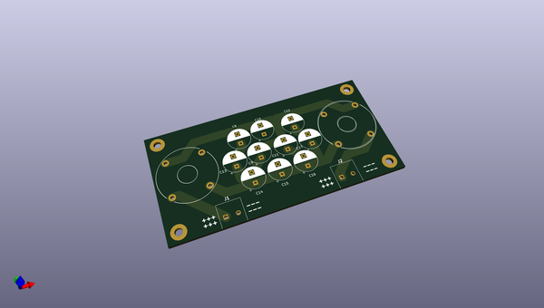
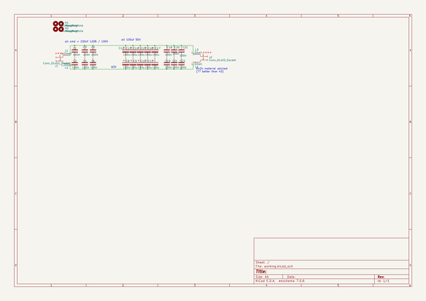
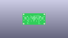
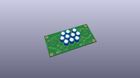
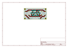
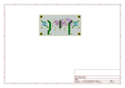
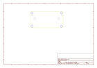
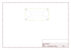
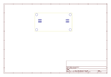
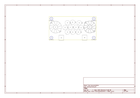

# OOMP Project  
## k_cc_filter  by F6ITU  
  
(snippet of original readme)  
  
- k_cc_filter  
Simple DC filter for Power Switching Unit (12 or 45V) (codename "Boufiltre")  
  
  
  
The whole network as a 100V service voltage   
  
L1/L4 could be omited and replaced by jumpers.   
  
  
  full source readme at [readme_src.md](readme_src.md)  
  
source repo at: [https://github.com/F6ITU/k_cc_filter](https://github.com/F6ITU/k_cc_filter)  
## Board  
  
  
## Schematic  
  
  
  
[schematic pdf](working_schematic.pdf)  
## Images  
  
  
  
  
  
  
  
  
  
  
  
  
  
  
  
  
