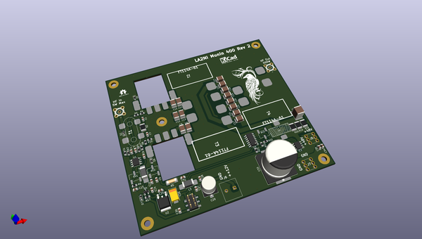
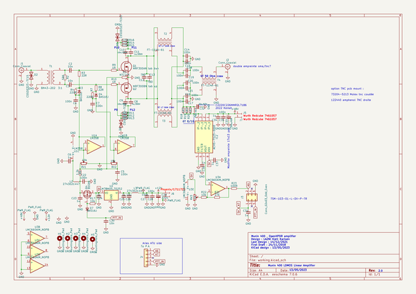
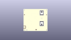
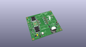
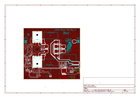
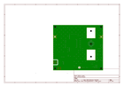
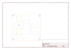
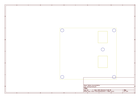
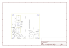

# OOMP Project  
## K_Munin400  by F6ITU  
  
(snippet of original readme)  
  
- K_Munin400  
LA2NI's OpenHPSDR 400W HF amplifier (Kicad Version)  
  
  
  
This amplifier board is part of a set consisting of a 400 W LD-Mos based RF power amplifier (Munin 400),   
a medium power Zolotarev low pass filter (600 or 1500 W), an Automatic Antenna Tuner (ATU) nickname « Aries »   
and a 4 port antenna switch.  
  
All these developments are the work and intellectual property of Kjell Karlsen LA2NI and Laurence Barker G8NJJ.  
  
This original work can be downloaded from  
  
https://github.com/LA2NI/  
  
https://github.com/laurencebarker  
  
  
This board was originally developed in December 2021 by Kjell LA2NI , with UltiBoard EDA. This repository is a « bug for bug »  
clone of the original amplifier using the Opensource Kicad EDA.   
All these KiCad files are, consequently, the intellectual property of Kjell LA2NI.  
  
This portage (convertion/translation) is placed under the CERN Open source/ Open hardware Licence.  
  
Kicad is an Opensource EDA software maintained by the European Reseach Center CERN (Conseil européen pour la recherche nucléaire)  
  
The original work is protected by the TAPR Open Hardware licence  
  
Munin and Hugin are the two "messenger" ravens of the Norse god Odin - just as Hermes is the messenger-god in Greek mythology,   
and the masterpiece of the OpenHPSDR architecture   
  
This LDMoS transistor-based amplifier brings speech over the great distances of the "Midgard" of the waves  
  
  
- Work  
  full source readme at [readme_src.md](readme_src.md)  
  
source repo at: [https://github.com/F6ITU/K_Munin400](https://github.com/F6ITU/K_Munin400)  
## Board  
  
  
## Schematic  
  
  
  
[schematic pdf](working_schematic.pdf)  
## Images  
  
  
  
  
  
  
  
  
  
  
  
  
  
  
  
  
