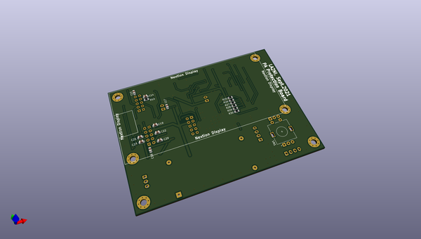
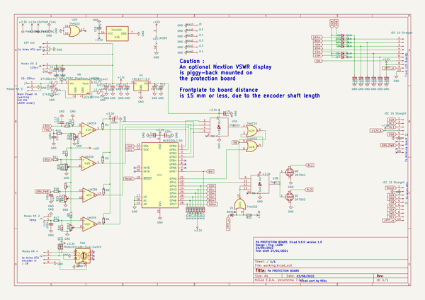
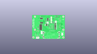
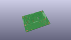
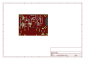
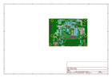
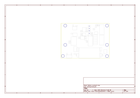
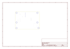
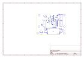
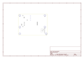

# OOMP Project  
## K_PA_Protec  by F6ITU  
  
(snippet of original readme)  
  
- K_PA_Protec  
  
OpenHPSDR P.A. OpenHPSDR Protection board by LA2NI (Munin 400)  
  
  
  
  
  
This protection board is part of a set consisting of a 400 W LD-Mos based RF power amplifier (Munin 400),   
a medium power (600 or 1500 W) Zolotarev low pass filter, an Automatic Antenna Tuner (ATU) nickname « Aries »   
and a 4 port antenna switch.  
  
All these developments are the work and intellectual property of Kjell Karlsen LA2NI and Laurence Barker G8NJJ.  
  
This original work can be downloaded from   
  
https://github.com/LA2NI/  
  
  
https://github.com/laurencebarker  
  
The protection board ensures the physical measurements of the amplifier (VSWR, Power, Voltage, Current) and the shutdown of this amplifier in case of issues detected   
either by Aries (too high VSWR) or by any other sensor located on the amplifier itself or the ATU(temperature, voltage, current). It is used between Aries and Munin 400.   
  
For more information, please refer to the Aries documentation (in the G8NJJ github repository)  
  
  
This board was originally developed in September 2021 by Kjell LA2NI , with UltiBoard EDA. This repository is a « bug for bug » clone of the original Protection Board using the Opensource   
Kicad EDA. All these KiCad files are, consequently, the intellectual property of Kjell LA2NI.  
  
This portage (convertion/translation) is placed under the CERN Open source/ Open hardware Licence.  
  
Kicad  
  full source readme at [readme_src.md](readme_src.md)  
  
source repo at: [https://github.com/F6ITU/K_PA_Protec](https://github.com/F6ITU/K_PA_Protec)  
## Board  
  
  
## Schematic  
  
  
  
[schematic pdf](working_schematic.pdf)  
## Images  
  
  
  
  
  
  
  
  
  
  
  
  
  
  
  
  
