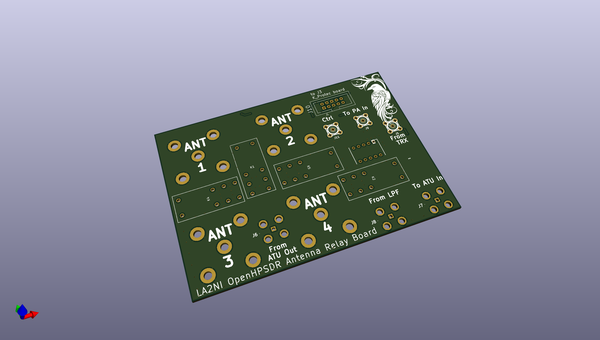
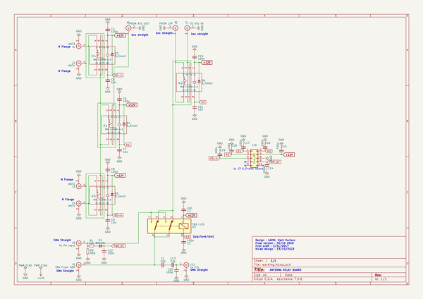
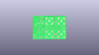
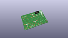
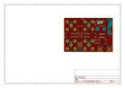
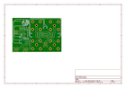
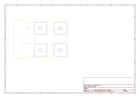
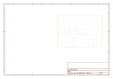
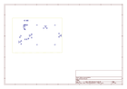
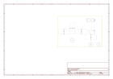

# OOMP Project  
## K_Relay_Board  by F6ITU  
  
oomp key: oomp_projects_flat_f6itu_k_relay_board  
(snippet of original readme)  
  
- K_Relay_Board  
LA2NI's OpenHPSDR 4 ways HF relay board (Kicad Version)  
  
  
OpenHPSDR P.A. Antenna switch board by LA2NI (Munin 400/Aries system)  
  
  
  
  
  
  
  
This relay board is part of a set consisting of a 400 W LDMos based RF power amplifier (Munin 400),   
a medium power (600 or 1500 W) Zolotarev low pass filter, an Automatic Antenna Tuner (ATU) nickname « Aries »   
and a 4 port antenna switch (this project).  
  
All these developments are the work and intellectual property of Kjell Karlsen LA2NI and Laurence Barker G8NJJ.  
  
This original work can be downloaded from   
  
https://github.com/LA2NI/  
  
  
https://github.com/laurencebarker  
  
The Antenna switch board ensures the switching between 4 antennas under the control of the Aries ATU board. Each of the connected antennas  
have a profile stored in the memory of the Aries MCU module. This way, switching from an antenna to the other don't need a new   
tuning solution if the couple "frequency/antenna" has already been defined.   
  
For more information, please refer to the Aries documentation (in the G8NJJ github repository)  
  
  
This board was originally developed in September 2021 by Kjell LA2NI , with UltiBoard EDA. This repository is a « bug for bug » clone of the original Protection Board using the Opensource   
Kicad EDA. All these KiCad files are, consequently, the  
  full source readme at [readme_src.md](readme_src.md)  
  
source repo at: [https://github.com/F6ITU/K_Relay_Board](https://github.com/F6ITU/K_Relay_Board)  
## Board  
  
  
## Schematic  
  
  
  
[schematic pdf](working_schematic.pdf)  
## Images  
  
  
  
  
  
  
  
  
  
  
  
  
  
  
  
  
