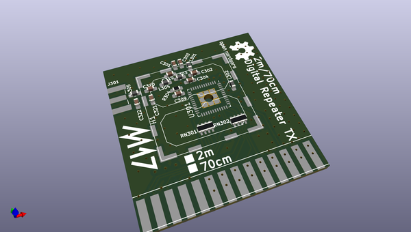
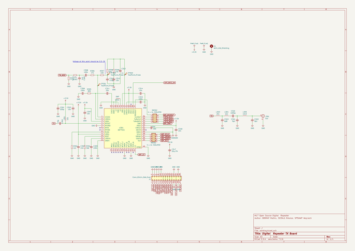

# OOMP Project  
## M17_RPTR_Kicad  by F6ITU  
  
oomp key: oomp_projects_flat_f6itu_m17_rptr_kicad  
(snippet of original readme)  
  
- M17_RPTR_Kicad  
Rough Kicad translation from the original Eagle M17_Repeater  
  
This repository should definitely NOT be used to generate Gerber files or considered as a serious development base for the M17 Repeater Project  
  
So far, still a lot of tidying need to be done  
  
Please refer to the original files of the project at   
https://github.com/M17-Project/M17_Repeater  
  
  
  full source readme at [readme_src.md](readme_src.md)  
  
source repo at: [https://github.com/F6ITU/M17_RPTR_Kicad](https://github.com/F6ITU/M17_RPTR_Kicad)  
## Board  
  
  
## Schematic  
  
  
  
[schematic pdf](working_schematic.pdf)  
## Images  
