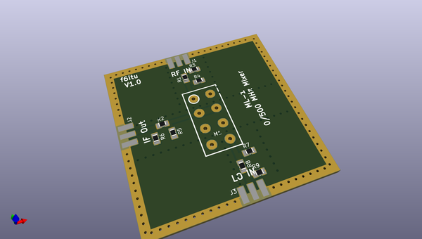
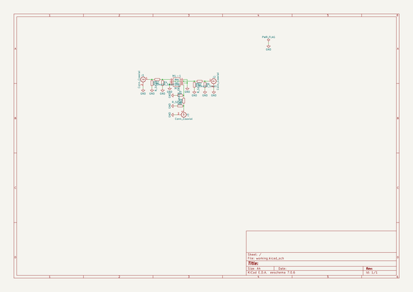

# OOMP Project  
## Mixer  by F6ITU  
  
(snippet of original readme)  
  
- Mixer  
A simple high level diode mixer module for sub-ghz experiment  
  
This board has been designed for educational purpose and could be uses in conjunction of the "Aion" 18 dBm reference clock   
  
https://github.com/F6ITU/OCXO   
  
The project has been designed with Kicad, the Open Source EDA software designed by the CERN. Many   
  
This board supports a "general purpose" balanced diode mixer (MD108, SRA1H, ML1).  
  
Each input and output port could also support a "Pi" attenuator, to adapt impedance and level of the RF signal.  
  
Many bare areas in the soldermask have been provided to allow some shielding : around the pcb itself, and under the board for a better port   
insulation and a lower crosstalk.   
  
lease note that there is no real "standardization" concerning mixer's pinout. A careful reading of the datasheet is mandatory before soldering the device   
and plugging high-level (+7 dBm or more)signals¨.  
  
The "bpf_Filter" subdirectory contains several LC 5th order LC bandpass filter simulations and schematics using the "AADE Filter Design" software.   
These filter could be plugged on the "IF out" connector to selec the "good" RF mixing product.  
  
  
  full source readme at [readme_src.md](readme_src.md)  
  
source repo at: [https://github.com/F6ITU/Mixer](https://github.com/F6ITU/Mixer)  
## Board  
  
  
## Schematic  
  
  
  
[schematic pdf](working_schematic.pdf)  
## Images  
