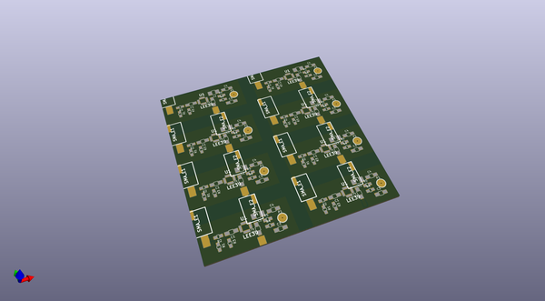
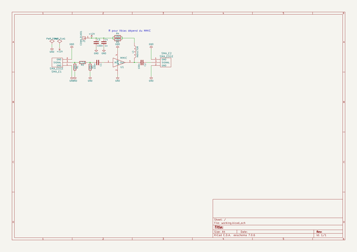

# OOMP Project  
## MMIC_Amp  by F6ITU  
  
oomp key: oomp_projects_flat_f6itu_mmic_amp  
(snippet of original readme)  
  
- MMIC_Amp  
A small RF mmic 20dB preamp for the G6ALU 20 W linear  
  
  full source readme at [readme_src.md](readme_src.md)  
  
source repo at: [https://github.com/F6ITU/MMIC_Amp](https://github.com/F6ITU/MMIC_Amp)  
## Board  
  
  
## Schematic  
  
  
  
[schematic pdf](working_schematic.pdf)  
## Images  
