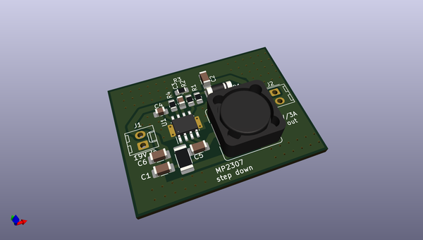
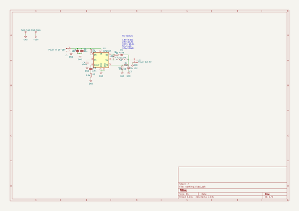
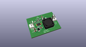
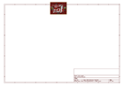
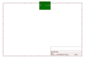
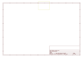
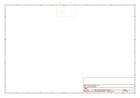
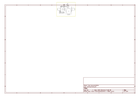

# OOMP Project  
## MP2393-2307-Simple-3A-stepdown-converter  by F6ITU  
  
oomp key: oomp_projects_flat_f6itu_mp2393_2307_simple_3a_stepdown_converter  
(snippet of original readme)  
  
- MP2393-2307-Simple-3A-stepdown-converter  
  
This pcb is a 30x40mm module using a MP2393 or MP2307 switching device (almost deprecated) able to deliver 3 amps  
 from any 5 to 23V source and delivering any voltage below (1.3, 1.8, 3.3 or 5V for exemple)   
 This module has been design to replace the hard to find LMZ22005TZ used by the PiHPSDR and Andromeda HPSDR radio interfaces.   
   
   
  full source readme at [readme_src.md](readme_src.md)  
  
source repo at: [https://github.com/F6ITU/MP2393-2307-Simple-3A-stepdown-converter](https://github.com/F6ITU/MP2393-2307-Simple-3A-stepdown-converter)  
## Board  
  
  
## Schematic  
  
  
  
[schematic pdf](working_schematic.pdf)  
## Images  
  
  
  
  
  
  
  
  
  
  
  
  
  
  
  
  
