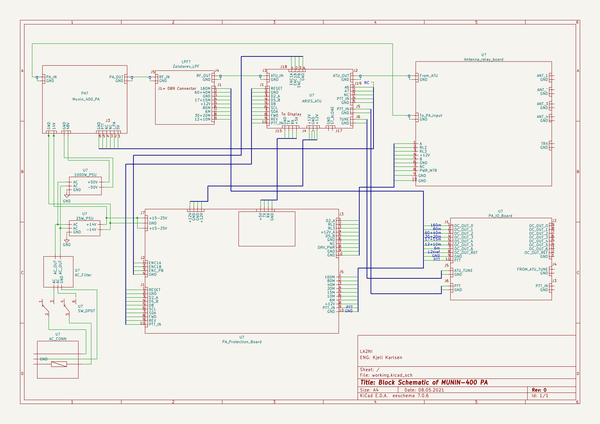

# OOMP Project  
## Munin-400  by F6ITU  
  
(snippet of original readme)  
  
- Munin 400  
 400W HF Amplifier  
Munin 400 uses a pair of MRF300AN/ MRF300BN LDMOS Transistors from NXP. The .pdf file named MRF300AN/BN_1p8_150MHz_PDF.pdf is an Application Report from NXP describing the use of the transistors in a 400W HF/VHF Power Amplifier that is delivering 400W PEP on all amateur bands from 1,8 MHz to 145 MHz. By using a special transformer on the input they get 400W PEP also on 145 MHz. I have not been able to find the described transformer but the prototype I have tested is very broad banded. I have not tested it on VHF at all.  
The PCB layout is for use with the schematic named Munin 400_rev2.pdf. At the moment(September 2021) I am building a complete PA with Power supply and ATU built in. I reclon that I´ll test it in the nearese future.  
  
  full source readme at [readme_src.md](readme_src.md)  
  
source repo at: [https://github.com/F6ITU/Munin-400](https://github.com/F6ITU/Munin-400)  
## Board  
  
  
## Schematic  
  
  
  
[schematic pdf](working_schematic.pdf)  
## Images  
