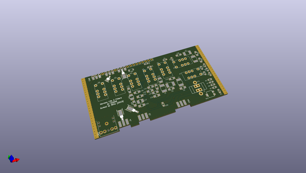
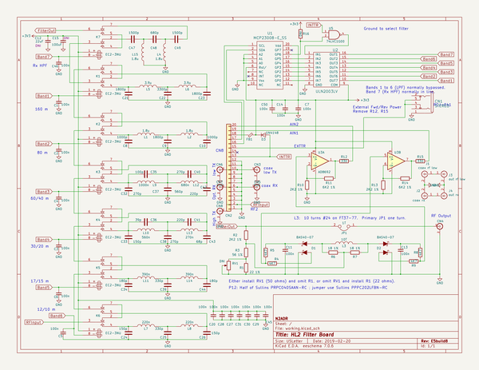

# OOMP Project  
## N2ADR  by F6ITU  
  
(snippet of original readme)  
  
- N2ADR  
N2ADR HPF &amp;  lpf for the Hermes Lite V2 project (fork heavily modified)   
  
This fork of the original N2ADR filter project (https://github.com/softerhardware/Hermes-Lite2/tree/master/hardware/companions/n2adr )  
is designed on less expansive 2 sides only PCB. This filter can be directly plugged on a Hermes Lite V2 board or installed as a "piggy back" extension  
fixed over the HL2 main board. This way, all input/output of the transmission system are located on the main frontplate of the transceiver.   
  
  - TR/PTT I/O is now using the same stereo jack used on the HL2 board  
  - RX only SMA plug has been added  
  - "Low power TX" and "RX only" RF path are routed thru coaxial jumpers to avoid impedance mismatch   
  - A heavy stitching of the board compensates the lack of insulation between RF traces and command bus  
  
A specific pcb frontpanel is under development to accomodate this new configuration.   
  
Caveat emptor :   
  
This fork is a prototype. If you don't like risks, please built the original design   
  
  
    
  
    
  
  
  full source readme at [readme_src.md](readme_src.md)  
  
source repo at: [https://github.com/F6ITU/N2ADR](https://github.com/F6ITU/N2ADR)  
## Board  
  
  
## Schematic  
  
  
  
[schematic pdf](working_schematic.pdf)  
## Images  
